# HTTP 笔记

> 讨论范围仅限 HTTP/1.1，文中的优缺点分析也仅针对 HTTP/1.1。

## 笔记导读

- 先看“HTTP 特点：优势与劣势”和“HTTP 从请求到响应的过程”，建立整体认知与链路视角。
- 再按“报文结构 -> 数据传输与编码 -> 文件传输 -> 连接管理”理解 HTTP/1.1 的核心机制。
- 接着看“重定向 -> Cookie -> 缓存 -> 代理”，把状态保持、缓存复用和中间层串起来。
- 然后看“HTTPS/TLS -> HTTP/2 -> HTTP/3 -> WebSocket”，理解安全升级与协议演进。
- 最后看“服务端基础设施 -> 性能优化 -> 实验环境”，把知识点落到工程实践上。

## 面试速查版

### 1. HTTP 核心特征

- 应用层协议，基于 TCP/IP。
- 采用请求-应答模型，客户端主动发起，服务器被动响应。
- 无状态，天然利于扩容，但需要 Cookie 等机制补状态。
- 灵活可扩展，请求方法、状态码、头字段都可扩展。
- HTTP/1.1 默认支持长连接。

### 2. HTTP 的优缺点

- 优点：简单、灵活、通用、生态成熟。
- 缺点：明文传输、不验证身份、不校验完整性、HTTP/1.1 存在队头阻塞。
- 结论：安全问题靠 HTTPS 补足，性能问题靠缓存、连接复用、HTTP/2、HTTP/3 改善。

### 3. 一次访问网页的链路

1. 建立 TCP 连接，完成三次握手。
2. 浏览器发送 HTTP 请求报文。
3. 服务器解析请求并返回 HTTP 响应报文。
4. 浏览器解析 HTML，可能继续请求 CSS、JS、图片、favicon。
5. 连接根据策略保持或关闭，关闭时经历 TCP 四次挥手。

### 4. 报文结构速记

- 请求报文：请求行 + 请求头 + 空行 + 可选消息体。
- 响应报文：状态行 + 响应头 + 空行 + 可选消息体。
- 常见请求行格式：`GET /index.html HTTP/1.1`
- 常见状态行格式：`HTTP/1.1 200 OK`

### 5. 常见请求方法

- GET：获取资源，安全且幂等。
- HEAD：只取响应头，安全且幂等。
- POST：提交数据，通常用于新建，不幂等。
- PUT：更新资源，通常幂等。
- DELETE：删除资源，语义上幂等。
- OPTIONS：询问资源支持哪些方法。
- CONNECT：建立隧道，多用于代理。
- TRACE：链路诊断，实际中常被禁用。

### 6. 常见状态码

- `200 OK`：请求成功。
- `204 No Content`：成功但没有消息体。
- `206 Partial Content`：范围请求成功。
- `301 Moved Permanently`：永久重定向。
- `302 Found`：临时重定向。
- `304 Not Modified`：缓存仍可用。
- `400 Bad Request`：请求报文有误。
- `403 Forbidden`：服务器禁止访问。
- `404 Not Found`：资源不存在。
- `405 Method Not Allowed`：方法不被允许。
- `500 Internal Server Error`：服务器内部错误。
- `502 Bad Gateway`：网关或代理错误。
- `503 Service Unavailable`：服务暂时不可用。

### 7. 高频头字段

- `Host`：HTTP/1.1 必须字段，用于区分虚拟主机。
- `User-Agent`：客户端标识。
- `Content-Type`：消息体类型。
- `Content-Length`：消息体长度。
- `Transfer-Encoding: chunked`：分块传输。
- `Accept` / `Accept-Encoding` / `Accept-Language`：内容协商。
- `Content-Encoding`：消息体压缩方式。
- `Connection`：连接管理，如 `keep-alive`、`close`。
- `Location`：重定向目标地址。
- `Cookie` / `Set-Cookie`：状态保持。
- `Cache-Control` / `ETag` / `Last-Modified`：缓存控制。

### 8. 文件传输与连接管理

- 大文件传输可用 `chunked` 分块传输。
- 断点续传依赖范围请求：`Range` + `206 Partial Content`。
- HTTP/1.0 常见短连接，HTTP/1.1 默认长连接。
- 长连接降低重复建连成本，但会占用服务器资源。
- HTTP/1.1 的队头阻塞无法根治，只能通过并发连接等方式缓解。

### 9. 重定向、Cookie、缓存

- 301 表示永久迁移，302 表示临时迁移。
- `Location` 指定跳转目标。
- Cookie 用于身份识别和状态保持。
- Cookie 常见属性：`Expires`、`Max-Age`、`Domain`、`Path`、`HttpOnly`、`Secure`、`SameSite`。
- 强缓存优先减少请求，协商缓存通过 `304 Not Modified` 减少重复传输。

### 10. 面试高频一句话

- HTTP 是基于 TCP 的应用层、无状态、请求-应答协议。
- HTTP/1.1 的性能瓶颈主要在长报文串行处理和队头阻塞。
- HTTPS 本质是 HTTP + TLS，用来解决明文、不认证、不校验完整性的问题。
- Cookie 解决的是“记住你是谁”，缓存解决的是“别重复拿同一份资源”。

## 目录
- [面试速查版](#面试速查版)
- [HTTP 特点：优势与劣势](#http-特点优势与劣势)
  - [灵活可扩展](#灵活可扩展)
  - [可靠传输](#可靠传输)
  - [应用层协议](#应用层协议)
  - [请求-应答](#请求-应答)
  - [无状态](#无状态)
  - [应用广泛、环境成熟](#应用广泛环境成熟)
  - [明文](#明文)
  - [不安全](#不安全)
  - [性能](#性能)
  - [其他特点](#其他特点)
- [HTTP 从请求到响应的过程](#http-从请求到响应的过程)
  - [简单的服务器搭建](#简单的服务器搭建)
  - [使用 IP 访问网页](#使用-ip-访问网页)
- [HTTP 报文结构](#http-报文结构)
  - [请求行](#请求行)
    - [标准请求方法](#标准请求方法)
    - [URI 的正确格式](#uri-的正确格式)
  - [状态行](#状态行)
    - [状态码](#状态码)
      - [1. 1××](#1-1)
      - [2. 2××](#2-2)
      - [3. 3××](#3-3)
      - [4. 4××](#4-4)
      - [5. 5××](#5-5)
  - [头部字段](#头部字段)
    - [常用头字段](#常用头字段)
- [HTTP 数据传输与编码](#http-数据传输与编码)
  - [语言类型\&字符集](#语言类型字符集)
  - [内容协商的质量值](#内容协商的质量值)
  - [内容协商的结果](#内容协商的结果)
- [HTTP 文件传输](#http-文件传输)
  - [数据压缩](#数据压缩)
  - [分块传输](#分块传输)
  - [范围请求](#范围请求)
- [HTTP 连接管理](#http-连接管理)
  - [短连接](#短连接)
  - [长连接](#长连接)
  - [连接相关的头字段](#连接相关的头字段)
  - [请求-应答模型导致队头阻塞](#请求-应答模型导致队头阻塞)
- [HTTP 的重定向与跳转](#http-的重定向与跳转)
  - [重定向的过程](#重定向的过程)
  - [重定向状态码](#重定向状态码)
  - [重定向的应用场景](#重定向的应用场景)
  - [重定向的相关问题](#重定向的相关问题)
- [HTTP 的 Cookie 机制](#http-的-cookie-机制)
  - [工作过程](#工作过程)
  - [Cookie 的属性](#cookie-的属性)
  - [Cookie 的应用](#cookie-的应用)
- [HTTP 缓存控制](#http-缓存控制)
  - [缓存的两种思路](#缓存的两种思路)
  - [常见缓存字段](#常见缓存字段)
  - [常见 Cache-Control 指令](#常见-cache-control-指令)
  - [强缓存与协商缓存的区别](#强缓存与协商缓存的区别)
  - [实战速记](#实战速记)
  - [本节小结](#本节小结)
- [HTTP 的代理服务](#http-的代理服务)
  - [代理的基本概念](#代理的基本概念)
  - [代理的作用](#代理的作用)
  - [代理相关头字段](#代理相关头字段)
  - [代理协议](#代理协议)
- [HTTP 的缓存代理](#http-的缓存代理)
  - [缓存代理是什么](#缓存代理是什么)
  - [缓存代理的控制字段](#缓存代理的控制字段)
  - [缓存代理的风险与清理](#缓存代理的风险与清理)
  - [本节小结](#本节小结)
- [HTTPS 与 TLS](#https-与-tls)
  - [HTTPS 是什么](#https-是什么)
  - [通信安全的四个目标](#通信安全的四个目标)
  - [对称加密与非对称加密](#对称加密与非对称加密)
  - [摘要算法数字签名与证书](#摘要算法数字签名与证书)
  - [TLS1.2 握手过程](#tls12-握手过程)
  - [DHE / ECDHE 为什么能安全交换密钥](#dhe--ecdhe-为什么能安全交换密钥)
  - [TLS1.3 的改进](#tls13-的改进)
  - [HTTPS 的优化手段](#https-的优化手段)
  - [HTTP 迁移到 HTTPS](#http-迁移到-https)
  - [本章速记](#本章速记)
- [HTTP/2](#http2)
  - [HTTP/2 的核心变化](#http2-的核心变化)
  - [帧流与多路复用](#帧流与多路复用)
  - [HTTP/2 的细节记忆点](#http2-的细节记忆点)
  - [HTTP/2 的优劣与迁移](#http2-的优劣与迁移)
  - [本章速记](#本章速记-1)
- [HTTP/3 与 QUIC](#http3-与-quic)
  - [为什么需要 HTTP/3](#为什么需要-http3)
  - [QUIC 的关键特性](#quic-的关键特性)
  - [HTTP/3 的工作方式](#http3-的工作方式)
  - [本章速记](#本章速记-2)
- [HTTP/3 实验版观察](#http3-实验版观察)
  - [当前落地现状](#当前落地现状)
  - [如何快速验证](#如何快速验证)
  - [抓包时看什么](#抓包时看什么)
  - [本章速记](#本章速记-3)
- [WebSocket](#websocket)
  - [为什么会有 WebSocket](#为什么会有-websocket)
  - [WebSocket 的特点](#websocket-的特点)
  - [WebSocket 的握手过程](#websocket-的握手过程)
  - [本章速记](#本章速记-4)
- [Nginx](#nginx)
  - [为什么 Nginx 很常见](#为什么-nginx-很常见)
  - [Nginx 的核心工作方式](#nginx-的核心工作方式)
  - [本章速记](#本章速记-5)
- [OpenResty](#openresty)
  - [为什么需要 OpenResty](#为什么需要-openresty)
  - [OpenResty 的核心特点](#openresty-的核心特点)
  - [本章速记](#本章速记-6)
- [WAF](#waf)
  - [WAF 是什么](#waf-是什么)
  - [WAF 的能力与代价](#waf-的能力与代价)
  - [本章速记](#本章速记-7)
- [CDN](#cdn)
  - [为什么需要 CDN](#为什么需要-cdn)
  - [CDN 的核心组成](#cdn-的核心组成)
  - [CDN 的关键指标](#cdn-的关键指标)
  - [本章速记](#本章速记-8)
- [HTTP 性能优化](#http-性能优化)
  - [先看指标，不要上来就调参](#先看指标不要上来就调参)
  - [常见优化抓手](#常见优化抓手)
  - [排查思路速记](#排查思路速记)
  - [本章速记](#本章速记-9)
- [实验环境补充](#实验环境补充)
  - [为什么很多人改用 Docker](#为什么很多人改用-docker)
  - [最小操作清单](#最小操作清单)
  - [本章速记](#本章速记-10)

# HTTP 特点：优势与劣势

## 灵活可扩展

- 核心理解：HTTP 只严格约定了报文的大框架，没有把很多细节“写死”。
- 可扩展点：请求方法、URI、状态码、头字段、消息体类型都能持续扩展。
- 演进方式：先有实践，再由 RFC 标准化，因此协议生命力很强。
- 直接结果：HTTP 不只传文本，也能传图片、音频、视频、JSON 等各种数据。
- 典型例子：DNT（Do Not Track）就是通过头字段扩展出来的能力。
- 进一步理解：HTTP 不绑定某一种下层传输，可以跑在 TCP、TLS，甚至 QUIC 之上。

## 可靠传输

- HTTP 的“可靠”主要来自 TCP。
- 也就是说：HTTP 自己不直接保证可靠性，而是继承下层 TCP 的能力。
- 这里的可靠不是 100% 成功，而是“在正常网络条件下尽量完整送达”。
- 网络极差、链路中断、设备故障时，HTTP 依然可能失败。
- 记忆点：HTTP 负责语义，TCP 更偏向传输可靠性。

## 应用层协议

- HTTP 属于应用层协议。
- 和 FTP、SMTP、SSH 这类专用协议相比，HTTP 更通用。
- 原因：它的报文结构足够灵活，能承载各种业务数据。
- 实际效果：只要性能不是极端苛刻，HTTP 几乎能承载大多数应用通信场景。

## 请求-应答

- HTTP 使用请求-应答模型。
- 直观理解：客户端发一次请求，服务器回一次响应。
- 角色分工：客户端主动，服务器被动。
- 没有请求时，服务器不会凭空给浏览器推一条普通 HTTP/1.1 响应。
- 这个模型天然适合 C/S、B/S，也能承载 RPC、REST 风格接口。

## 无状态

- HTTP 默认无状态。
- 含义：协议本身不要求服务器记住上一次请求是谁发来的。
- 每个请求原则上都是独立的。
- 好处：实现简单、服务器压力更小、容易做负载均衡和集群扩容。
- 坏处：连续业务流程很麻烦，比如登录、购物车、下单都需要重复识别用户。
- 补救方式：Cookie、Session 等机制给无状态协议补状态。

- “无状态”优势

  - 不需要额外记录会话状态，实现更简单。
  - 服务器压力更小，可以把资源更多用于处理请求。
  - 更适合做集群和负载均衡，横向扩容更容易。

- “无状态”劣势

  - 不适合直接处理连续事务，比如登录、购物车、下单。
  - 每次请求都可能要重复携带身份信息。
  - 所以真实系统里通常会配合 Cookie 之类的机制补状态。

## 应用广泛、环境成熟

- HTTP 的应用范围非常广：网页、接口、移动端、后端服务都在用。
- 它天然跨语言、跨平台，几乎所有主流语言都有成熟库和工具链。
- 配套基础设施也非常成熟，比如 CDN、代理、缓存、网关、抓包工具。
- 结论：HTTP 是开发者的基础能力，不只是前端知识点。

## 明文

- HTTP/1.1 报文可读性强，便于开发、调试、抓包分析。
- 这也是它的风险点：数据以明文形式暴露在传输链路上。
- 一旦链路被监听，账号、口令、Cookie 等敏感信息就可能泄露。
- 典型风险场景：公共 WiFi 抓包、链路窃听、中间人攻击。

## 不安全

- HTTP 的安全问题不只在明文，还包括身份认证和完整性校验不足。
- 也就是说：你不知道对面一定是谁，也不知道消息是否被篡改。
- 这会带来仿冒网站、钓鱼、中间人篡改等风险。
- 解决方案：使用 HTTPS，在 HTTP 外面加上 TLS。

## 性能

- 对 HTTP/1.1 来说，性能评价可以记成一句话：能用，但不够极致。
- 限制点一：底层仍受 TCP 连接质量影响。
- 限制点二：请求-应答模型会带来队头阻塞。
- 常见优化手段：长连接、缓存、压缩、分片、资源合并。
- 升级方向：HTTP/2、HTTP/3 进一步改善性能问题。

## 其他特点

- HTTP 还支持缓存、压缩、范围请求、国际化、认证等能力。
- 这些能力本质上都可以看成“灵活可扩展”的延伸结果。

### 本节小结

- HTTP 灵活且易扩展，可以通过头字段、方法、状态码等机制不断演进。
- HTTP 基于 TCP/IP，提供的是“尽量可靠”的传输能力，而不是绝对成功。
- HTTP 是通用的应用层协议，适合承载多种类型的数据交换。
- HTTP 采用请求-应答模式，由客户端主动发起，服务器被动响应。
- HTTP 天然无状态，因此易扩展、易水平扩容，但需要 Cookie 等机制补足连续交互能力。

# HTTP 从请求到响应的过程

## 简单的服务器搭建

- 使用 [测试项目](https://github.com/chronolaw/http_study) 搭建实验环境。
- Windows 里先启用 `Telnet`。
- 下载并解压 OpenResty 到 `D:\http_study\openresty`。
- 在 `hosts` 文件中添加本机映射：
~~~
127.0.0.1       www.chrono.com
127.0.0.1       www.metroid.net
127.0.0.1       origin.io
~~~
- `www` 文件夹里常用脚本：
  - `start`：启动 OpenResty。
  - `stop`：停止 OpenResty。
  - `reload`：重启 OpenResty。
  - `list`：查看进程。

## 使用 IP 访问网页

- 启动服务器后，使用 Wireshark 抓取 `http://127.0.0.1/` 的网络包。
- 浏览器输入 `127.0.0.1` 后，可以看到一次完整的 HTTP 访问链路。
- 重点观察四步：建连、请求页面、请求图标、关闭连接。

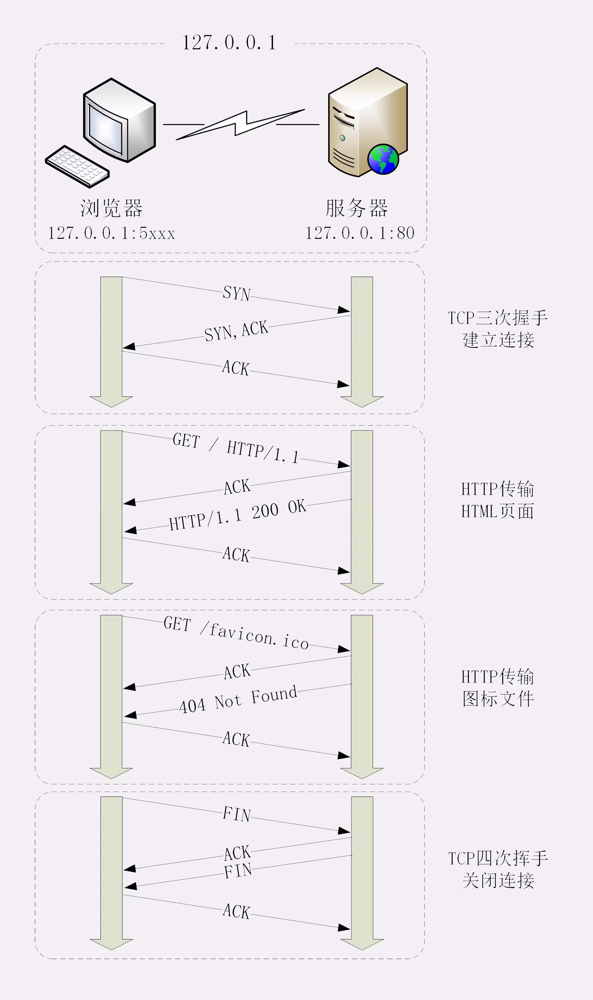

1. TCP 三次握手建立连接

- HTTP 先跑在 TCP 之上，所以第一步一定是先建 TCP 连接。
- 浏览器直接访问 IP，默认走 80 端口。
- Wireshark 中会先看到 `SYN -> SYN/ACK -> ACK` 三个包。

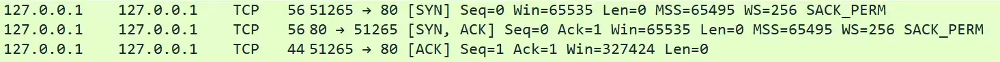

2. HTTP 传输 HTML 页面

- 连接建立后，浏览器发送 `GET / HTTP/1.1` 请求报文。
- 服务器先在 TCP 层确认收到数据，再在 HTTP 层解析请求。
- 找到目标资源后，服务器返回 `HTTP/1.1 200 OK` 和对应 HTML。
- 浏览器收到响应后解析 HTML，再交给渲染引擎显示页面。

3. HTTP 传输图标文件

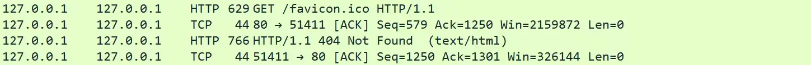

- 浏览器通常还会自动请求 `favicon.ico`。
- 如果服务器上没有该文件，就会返回 `404 Not Found`。
- 这说明一次页面访问往往不只对应一个 HTTP 请求。

4. TCP 四次挥手关闭连接

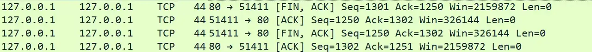

- HTTP/1.1 默认是长连接，所以访问结束后不会立刻断开。
- 连接最终关闭时，会看到 TCP 四次挥手。

# HTTP 报文结构

- HTTP 的核心不是“怎么传”，而是“传什么格式的报文”。
- 底层传输交给 TCP/IP，HTTP 更关注报文本身的语义。

- TCP 报文结构

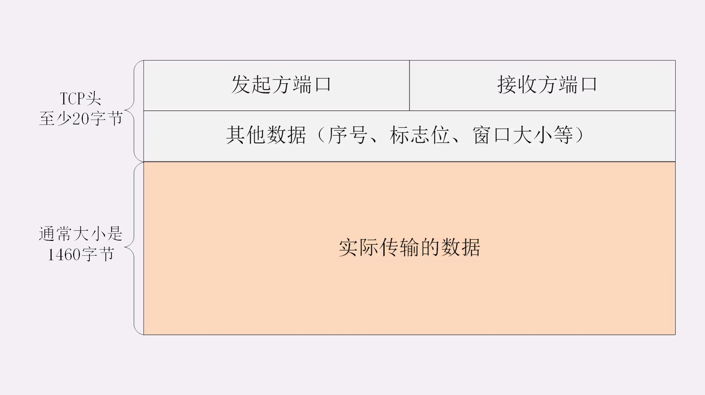

- HTTP 的报文结构

HTTP 请求报文和响应报文结构基本相同，都由三部分组成：

1. 起始行 / 请求行（start line）：描述请求或响应的基本信息。
2. 头部字段集合（header）：用 key-value 形式补充说明报文。
3. 消息正文（entity/body）：真正传输的数据，可以是文本，也可以是二进制。

- 协议要求必须有 header，但可以没有 body。
- header 结束后必须有一个空行，也就是 `CRLF`。

从 Wireshark 抓包中可以看到：

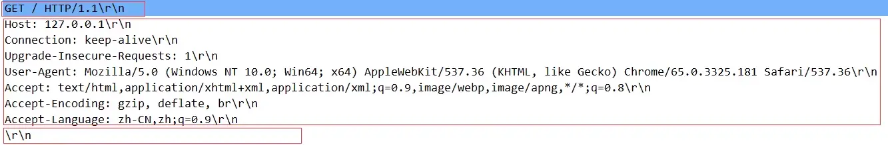

- 第一行 `GET / HTTP/1.1` 就是请求行。
- 后面的 `Host`、`Connection` 等都属于 header。
- 末尾空白行后如果没有数据，说明这次请求没有 body。

## 请求行

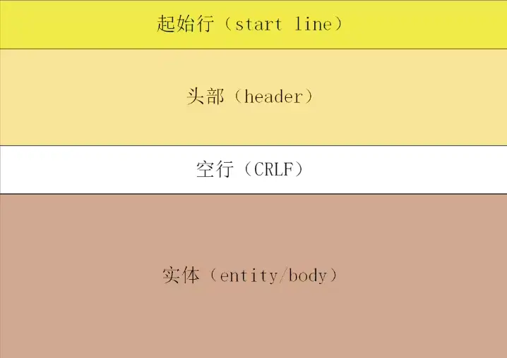

请求行描述“客户端想对哪个资源做什么”，由三部分构成：

1. 请求方法：如 GET、POST，表示动作。
2. 请求目标：通常是 URI，表示资源。
3. 版本号：表示使用的 HTTP 版本。

- 这三部分用空格分隔，最后用 `CRLF` 结束。

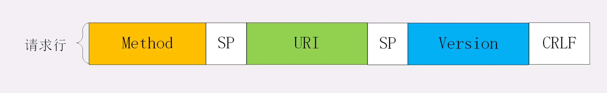

- `GET` 是请求方法。
- `/` 是请求目标。
- `HTTP/1.1` 是版本号。
- 可以把整行理解成：“请按 HTTP/1.1 的规则，把根路径资源返回给我。”

### 标准请求方法

HTTP/1.1 规定了八种标准请求方法，方法名通常都用大写。

1. GET：获取资源，可以理解为读取或者下载数据；
2. HEAD：获取资源的元信息；
3. POST：向资源提交数据，相当于写入或上传数据；
4. PUT：类似 POST；
5. DELETE：删除资源；
6. CONNECT：建立特殊的连接隧道；
7. OPTIONS：列出可对资源实行的方法；
8. TRACE：追踪请求 - 响应的传输路径。

要点：请求方法只是客户端的“意图表达”，最终是否允许执行，由服务器决定。

>例：
你发起了一个 GET 请求，想获取“/orders”这个文件，但这个文件保密级别比较高，不是谁都能看的，服务器就可以有如下的几种响应方式：
>
>1. 假装这个文件不存在，直接返回一个 404 Not found 报文；
>2. 稍微友好一点，明确告诉你有这个文件，但不允许访问，返回一个 403 Forbidden；
>3. 再宽松一些，返回 405 Method Not Allowed，然后用 Allow 头告诉你可以用 HEAD 方法获取文件的元信息。

- GET/HEAD

- GET：获取资源，是最常见的方法。
- GET 可配合其他头字段做更精细的读取控制。

>例如，在 URI 后使用“#”，就可以在获取页面后直接定位到某个标签所在的位置；使用 If-Modified-Since 字段就变成了“有条件的请求”，仅当资源被修改时才会执行获取动作；使用 Range 字段就是“范围请求”，只获取资源的一部分数据。

- HEAD：和 GET 语义接近，但通常只返回响应头，不返回 body。
- 适合拿资源元信息，比如判断文件是否存在、是否更新。

>比如，想要检查一个文件是否存在，只要发个 HEAD 请求就可以了，没有必要用 GET 把整个文件都取下来。再比如，要检查文件是否有最新版本，同样也应该用 HEAD，服务器会在响应头里把文件的修改时间传回来。

- POST/PUT

- POST 和 PUT 主要用于向服务器提交数据，数据通常放在 body 中。
- POST 常表示“提交”或“新建”，实际使用非常广。

>比如，你上论坛灌水，敲了一堆字后点击“发帖”按钮，浏览器就执行了一次 POST 请求，把你的文字放进报文的 body 里，然后拼好 POST 请求头，通过 TCP 协议发给服务器。

>又比如，你上购物网站，看到了一件心仪的商品，点击“加入购物车”，这时也会有 POST 请求，浏览器会把商品 ID 发给服务器，服务器再把 ID 写入你的购物车相关的数据库记录。

- PUT 和 POST 类似，但更偏向“整体更新”或“替换资源”。
- 面试里常见记法：POST 更像 `create`，PUT 更像 `update`。

- 其他方法

- DELETE：删除资源，语义上危险，实际中常受限制。
- CONNECT：建立隧道，多用于代理场景。
- OPTIONS：查询资源支持哪些操作。
- TRACE：链路诊断，因安全风险常被禁用。

- 扩展方法

- 标准方法只有八个，但协议本身允许扩展自定义方法。

- 安全与幂等

- 安全：不会修改服务器资源。
- 幂等：多次执行，结果相同。
- 一般记忆：GET、HEAD 安全且幂等；DELETE 幂等但不安全；POST 通常不幂等；PUT 通常幂等。

### URI 的正确格式

URI 本质上是一个字符串，用来唯一标记资源的位置或名字。

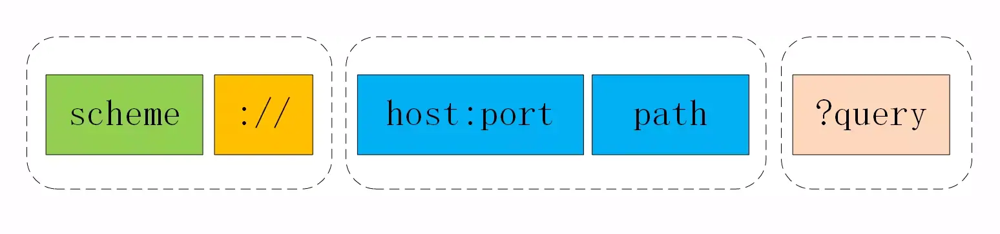

- URI 第一个组成部分叫 scheme，表示用什么协议访问资源。
>最常见的当然就是“http”了，表示使用 HTTP 协议。另外还有“https”，表示使用经过加密、安全的 HTTPS 协议。此外还有其他不是很常见的 scheme，例如 ftp、ldap、file、news 等。

- scheme 后通常跟着 `://`，用于和后续内容分隔。

- 再往后是 authority，通常写成 `host:port`。

>主机名可以是 IP 地址或者域名的形式，必须要有，否则浏览器就会找不到服务器。但端口号有时可以省略，浏览器等客户端会依据 scheme 使用默认的端口号，例如 HTTP 的默认端口号是 80，HTTPS 的默认端口号是 443。

- 然后是 path，用来标记资源路径。

>例：
>~~~
>http://nginx.org
>http://www.chrono.com:8080/11-1
>https://tools.ietf.org/html/rfc7230
>file:///D:/http_study/www/
>~~~
>第一个协议名是“http”，主机名是“nginx.org”，端口号省略，所以是默认的 80，而路径部分也被省略了，默认就是一个“/”，表示根目录。
>
>第二个 URI 主机名是“www.chrono.com”，端口号是 8080，后面的路径是“/11-1”。
>
>第三个是 HTTP 协议标准文档 RFC7230 的 URI，主机名是“tools.ietf.org”，路径是“/html/rfc7230”。
>
>最后一个 URI 要注意了，它的协议名不是“http”，而是“file”，表示这是本地文件，而后面居然有三个斜杠里的前两个属于 URI 特殊分隔符“://”，然后后面的“/D:/http_study/www/”是路径，而中间的主机名被“省略”了。这实际上是 file 类型 URI 的“特例”，它允许省略主机名，默认是本机 localhost。
>
>但对于 HTTP 或 HTTPS 这样的网络通信协议，主机名是绝对不能省略的。原因之前也说了，会导致浏览器无法找到服务器。

- 最后常见的是 query，也就是查询参数。

>使用“协议名 + 主机名 + 路径”的方式，已经可以精确定位网络上的任何资源了。但这还不够，很多时候我们还想在操作资源的时候附加一些额外的修饰参数。
>
>如获取商品图片，但想要一个 32×32 的缩略图版本；获取商品列表，但要按某种规则做分页和排序；跳转页面，但想要标记跳转前的原始页面。
>
>仅用“协议名 + 主机名 + 路径”的方式是无法适应这些场景的，所以 URI 后面还有一个“query”部分，它在 path 之后，用一个“?”开始，但不包含“?”，表示对资源附加的额外要求。这是个很形象的符号，比“://”要好的多，很明显地表示了“查询”的含义。
>
>查询参数 query 有一套自己的格式，是多个“key=value”的字符串，这些 KV 值用字符“&”连接，浏览器和客户端都可以按照这个格式把长串的查询参数解析成可理解的字典或关联数组形式。

- URI 的完整格式（已不推荐）

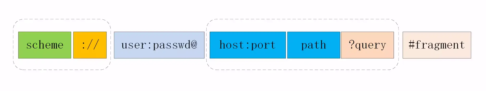

- `user:passwd@` 这种写法已不推荐，因为会暴露敏感信息。
- `#fragment` 表示资源内部锚点，只在浏览器端使用。
- 服务器通常看不到 `#fragment` 之后的内容。

- URI 的编码

- URI 中只能直接使用有限的 ASCII 字符。
- 遇到特殊字符或非 ASCII 字符时，需要做百分号编码。
- 规则：把字符转成十六进制字节值，再在前面加 `%`。

>例如，空格被转义成“%20”，“?”被转义成“%3F”。而中文、日文等则通常使用 UTF-8 编码后再转义，例如“银河”会被转义成“%E9%93%B6%E6%B2%B3”。

## 状态行

响应报文里的起始行，在这里它不叫"响应行"，而是叫"**状态行**"(status line),表示服务器响应的状态。

1. 版本号：表示报文使用的HTTP协议版本
2. 状态码：一个三位数，用代码的形式表示处理结果，比如 200 表示成功，500 表示服务器错误
3. 原因：作为数字状态码补充，是更详细的解释文字，帮助人理解原因

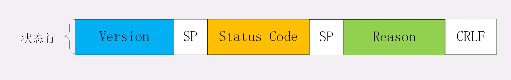

从Wireshark中抓取到的响应报文中：

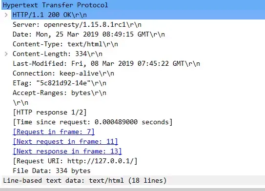

HTTP/1.1 表示这个报文使用的协议版本号是1.1，状态码是200，表示操作被成功接收并处理

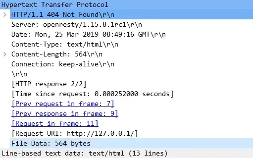

状态码是 404，表示请求已被服务器接收，但没有找到目标资源。

### 状态码

目前 RFC 标准里规定的状态码是三位数，所以取值范围就是从 000 到 999。但如果把代码简单地从 000 开始顺序编下去就显得有点太“low”，不灵活、不利于扩展，所以状态码也被设计成有一定的格式。

RFC 标准把状态码分成了五类，用数字的第一位表示分类，而 0~99 不用，这样状态码的实际可用范围就大大缩小了，由 000~999 变成了 100~599。

这五类的具体含义是：

1. 1××：提示信息，表示目前是协议处理的中间状态，还需要后续的操作；
2. 2××：成功，报文已经收到并被正确处理；
3. 3××：重定向，资源位置发生变动，需要客户端重新发送请求；
4. 4××：客户端错误，请求报文有误，服务器无法处理；
5. 5××：服务器错误，服务器在处理请求时内部发生了错误。

- 状态码是客户端和服务器共同约定的结果语义。
- 标准状态码是开放可扩展的，很多服务器也会有私有实现。

#### 1. 1××

- 1×× 表示处理中间状态，实际使用较少。
- 常见的是 `101 Switching Protocols`，表示协议切换，例如升级到 WebSocket。

#### 2. 2××

- 2×× 表示请求已被成功接收并处理。
- `200 OK`：最常见的成功响应，通常会带 body。
- `204 No Content`：成功但没有 body。
- `206 Partial Content`：范围请求成功，常搭配 `Content-Range` 使用。

#### 3. 3××

- 3×× 主要表示重定向或资源状态变化。
- `301 Moved Permanently`：永久重定向，适合域名迁移、HTTP 跳 HTTPS。
- `302 Found`：临时重定向，适合维护页、临时切流。
- `304 Not Modified`：资源未修改，用于协商缓存，不返回新的 body。
- 记忆点：`301/302` 看跳转，`304` 看缓存。

#### 4. 4××

- 4×× 表示客户端请求有误，服务器无法正常处理。
- `400 Bad Request`：通用请求错误，但信息不够具体。
- `403 Forbidden`：服务器拒绝访问。
- `404 Not Found`：资源不存在或未找到。
- 其他常见状态码：

- 405 Method Not Allowed：不允许使用某些方法操作资源，例如不允许 POST 只能 GET；
- 406 Not Acceptable：资源无法满足客户端请求的条件，例如请求中文但只有英文；
- 408 Request Timeout：请求超时，服务器等待了过长的时间；
- 409 Conflict：多个请求发生了冲突，可以理解为多线程并发时的竞态；
- 413 Request Entity Too Large：请求报文里的 body 太大；
- 414 Request-URI Too Long：请求行里的 URI 太大；
- 429 Too Many Requests：客户端发送了太多的请求，通常是由于服务器的限连策略；
- 431 Request Header Fields Too Large：请求头某个字段或总体太大；

#### 5. 5××

- 5×× 表示请求本身没问题，但服务器处理失败。
- `500 Internal Server Error`：通用服务器错误。
- `501 Not Implemented`：功能未实现。
- `502 Bad Gateway`：网关或代理访问上游失败。
- `503 Service Unavailable`：服务暂时不可用，常可搭配 `Retry-After`。

## 头部字段

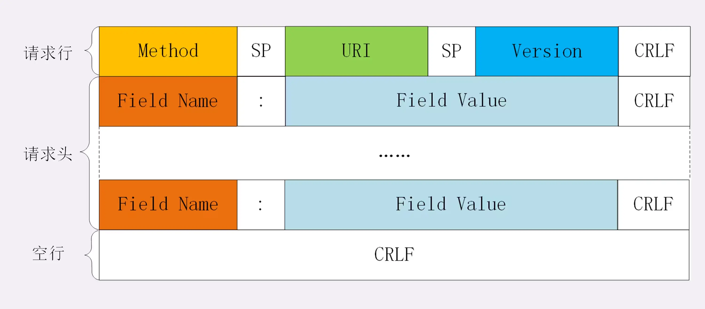
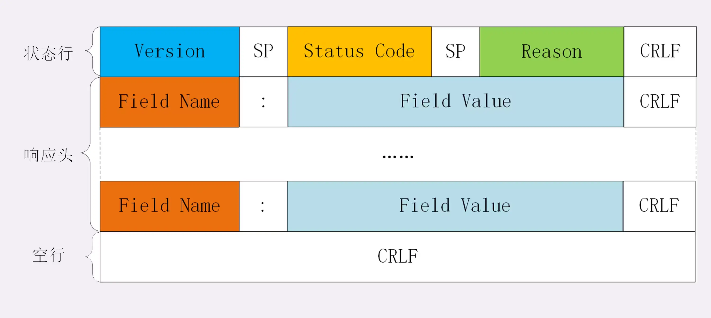

请求头和响应头在结构上非常接近，核心都是 header 字段集合。

- 头字段采用 key-value 形式，中间用 `:` 分隔。
- 每个字段用 `CRLF` 结束。
- HTTP 头字段扩展性很强，既能用标准字段，也能用自定义字段。

使用头字段时需要注意：
1. 字段名不区分大小写，例如"Host"可以写为"host"，但首字母大写可读性更好;
2. 字段名里不允许出现空格，可以使用"-",但不能使用"_",例如，“test-name”是合法的字段名，而“test name”“test_name”是不正确的字段名；
3. 字段名后面必须紧接着“:”，不能有空格，而“:”后的字段值前可以有多个空格；
4. 字段的顺序是没有意义的，可以任意排列不影响语义；
5. 字段原则上不能重复，除非这个字段本身的语义允许，例如 Set-Cookie。

### 常用头字段

HTTP 头字段按用途大致可以分为四类：

1. 通用字段：在请求头和响应头里都可以出现；
2. 请求字段：仅能出现在请求头里，进一步说明请求信息或者额外的附加条件；
3. 响应字段：仅能出现在响应头里，补充说明响应报文的信息；
4. 实体字段：它实际上属于通用字段，但专门描述 body 的额外信息。

- `Host`：请求字段，HTTP/1.1 中必须出现，用于区分虚拟主机。

>例如我们的试验环境，在 127.0.0.1 上有三个虚拟主机：“www.chrono.com”“www.metroid.net”和“origin.io”。那么当使用域名的方式访问时，就必须要用 Host 字段来区分这三个 IP 相同但域名不同的网站，否则服务器就会找不到合适的虚拟主机，无法处理。

- `User-Agent`：请求字段，用于描述客户端。

>由于历史的原因，User-Agent 非常混乱，每个浏览器都自称是“Mozilla”“Chrome”“Safari”，企图使用这个字段来互相“伪装”，导致 User-Agent 变得越来越长，最终变得毫无意义。

- `Date`：通用字段，常见于响应头，表示报文生成时间。

- `Server`：响应字段，表示服务器软件信息，但很多站点会隐藏或模糊处理。

>例如在我们的实验环境里它就是“Server: openresty/1.15.8.1”，即使用的是 OpenResty 1.15.8.1。GitHub，它的 Server 字段里就看不出是使用了 Apache 还是 Nginx，只是显示为“GitHub.com”。

- `Content-Length`：实体字段，表示 body 长度；没有它时，常要依赖 `chunked` 传输。

# HTTP 数据传输与编码

HTTP 不只要传数据，还要告诉接收方“这是什么数据”。

- 解决办法：使用 MIME type 描述 body 类型。
- 基本格式：`type/subtype`。
- 常见类型：

1. text：即文本格式的可读数据，我们最熟悉的应该就是 text/html 了，表示超文本文档，此外还有纯文本 text/plain、样式表 text/css 等。
2. image：即图像文件，有 image/gif、image/jpeg、image/png 等。
3. audio/video：音频和视频数据，例如 audio/mpeg、video/mp4 等。
4. application：数据格式不固定，可能是文本也可能是二进制，必须由上层应用程序来解释。常见的有 application/json，application/javascript、application/pdf 等，另外，如果实在是不知道数据是什么类型，像刚才说的“黑盒”，就会是 application/octet-stream，即不透明的二进制数据。

- 为节约带宽，HTTP 还会通过编码方式压缩数据。
- 常见压缩算法：

1. gzip：GNU zip 压缩格式，也是互联网上最流行的压缩格式；
2. deflate：zlib（deflate）压缩格式，流行程度仅次于 gzip；
3. br：一种专门为 HTTP 优化的新压缩算法（Brotli）。

## 语言类型&字符集

- 语言标签常写成 `语言-地区`，例如 `zh-CN`、`en-US`。

>例子：en 表示任意的英语，en-US 表示美式英语，en-GB 表示英式英语，而 zh-CN 就表示我们最常使用的汉语。

- HTTP 通过请求头和响应头做语言、字符集协商。

`Accept-Language` 表示客户端可接受的自然语言，例如：
~~~
Accept-Language: zh-CN, zh, en
~~~
- 服务器可以用 `Content-Language` 告知实际返回的语言：
~~~
Content-Language: zh-CN
~~~

- 字符集常通过 `Accept-Charset` 请求，响应时通常写在 `Content-Type; charset=...` 里。

>如浏览器请求 GBK 或 UTF-8 的字符集，然后服务器返回的是 UTF-8 编码，就是下面这样：
>~~~
>Accept-Charset: gbk, utf-8
>Content-Type: text/html; charset=utf-8
>~~~

- 实际开发里，浏览器往往不再主动发 `Accept-Charset`，最常见的是 `Accept-Language` + `Content-Type`。

>例
>~~~
>GET / HTTP/1.1
>Host: www.chrono.com
>Accept-Language: zh-CN, zh, en
>Accept-Charset: gbk, utf-8
>
>HTTP/1.1 200 OK
>Content-Language: zh-CN
>Content-Type: text/html; charset=utf-8
>
>...(entity data)
>~~~

## 内容协商的质量值

- 内容协商可用 `q` 参数表示优先级，`q` 来自 quality factor。
- 取值通常在 `0` 到 `1` 之间，默认值是 `1`。
- `q=0` 可理解为拒绝该选项。

>例：
>~~~
>Accept: text/html,application/xml;q=0.9,*/*;q=0.8
>~~~
>它表示浏览器最希望使用的是 HTML 文件，权重是 1，其次是 XML 文件，权重是 0.9，最后是任意数据类型，权重是 0.8。服务器收到请求头后，就会计算权重，再根据自己的实际情况优先输出 HTML 或者 XML。

## 内容协商的结果

- 服务器实际如何选内容并不透明，但可能会通过 `Vary` 提示参考了哪些请求头。
~~~
Vary: Accept-Encoding,User-Agent,Accept
~~~
- 上例表示服务器根据 `Accept-Encoding`、`User-Agent`、`Accept` 选择了最终响应。

# HTTP 文件传输

## 数据压缩

- 浏览器通过 `Accept-Encoding` 告诉服务器自己支持哪些压缩算法。
- 服务器通过 `Content-Encoding` 告知实际使用的压缩方式。
- 压缩最适合文本资源，对图片、音视频效果通常不明显。
- 结论：压缩是文本传输的常见加速手段。

## 分块传输

- 分块传输适合 body 很大、长度暂时未知的场景。
- 对应头字段：`Transfer-Encoding: chunked`。
- `chunked` 与 `Content-Length` 互斥，通常不会同时出现。
- 基本规则：每块都带长度，最后用长度为 `0` 的块结束。

1. 每个分块包含两个部分，长度头和数据块；
2. 长度头是以 CRLF（回车换行，即\r\n）结尾的一行明文，用 16 进制数字表示长度；
3. 数据块紧跟在长度头后，最后也用 CRLF 结尾，但数据不包含 CRLF；
4. 最后用一个长度为 0 的块表示结束，即“0\r\n\r\n”。

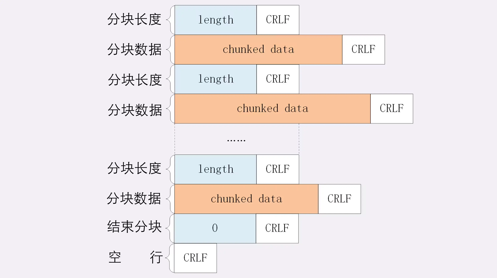

## 范围请求

- 范围请求允许客户端只取资源的一部分。
- 常见用途：断点续传、大文件预览、分段下载。
- 服务器若支持范围请求，通常会返回 `Accept-Ranges: bytes`。
- 请求头字段是 `Range`，常见格式为 `bytes=x-y`。
- 这里的 `x`、`y` 都是从 `0` 开始的偏移量。

>Range 的格式也很灵活，起点 x 和终点 y 可以省略，能够很方便地表示正数或者倒数的范围。假设文件是 100 个字节，那么：
>
>“0-”表示从文档起点到文档终点，相当于“0-99”，即整个文件；
>“10-”是从第 10 个字节开始到文档末尾，相当于“10-99”；
>“-1”是文档的最后一个字节，相当于“99-99”；
>“-10”是从文档末尾倒数 10 个字节，相当于“90-99”。

服务器收到 `Range` 后，核心要做三件事：

1. 检查范围是否合法，非法时返回 `416`。
2. 合法时返回 `206 Partial Content`。
3. 用 `Content-Range` 告知返回片段的实际范围。

- 多段数据

- `Range` 还支持一次请求多个片段。
- 这时响应通常使用 `multipart/byteranges`，并通过 `boundary` 分隔不同数据段。

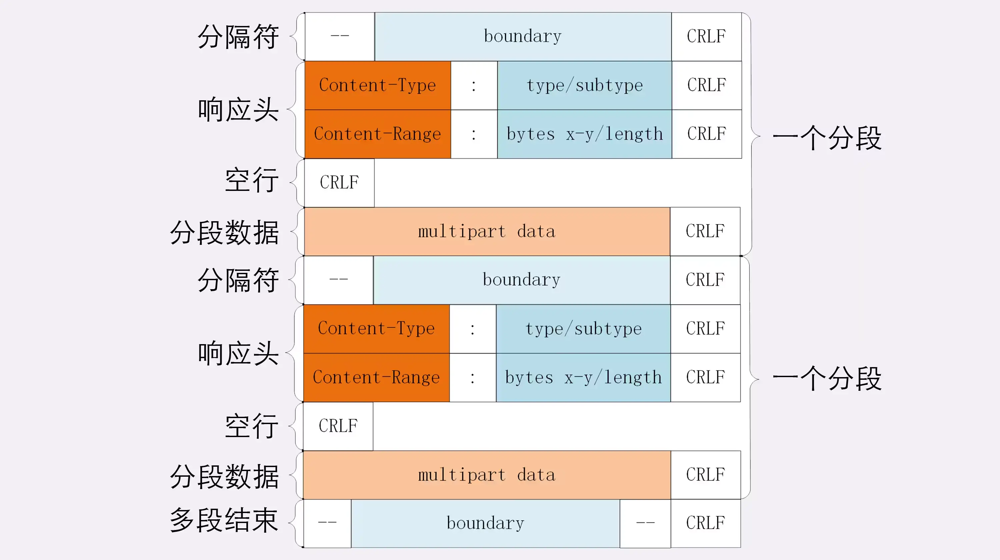

- 每段都要标出自己的 `Content-Type` 和 `Content-Range`。
- 所有分段最后由结束边界收尾。

例，我们在实验环境里用 Telnet 发出有两个范围的请求：
~~~
GET /16-2 HTTP/1.1
Host: www.chrono.com
Range: bytes=0-9, 20-29
~~~

得到的就会是下面这样：
~~~
HTTP/1.1 206 Partial Content
Content-Type: multipart/byteranges; boundary=00000000001
Content-Length: 189
Connection: keep-alive
Accept-Ranges: bytes
 
 
--00000000001
Content-Type: text/plain
Content-Range: bytes 0-9/96
 
// this is
--00000000001
Content-Type: text/plain
Content-Range: bytes 20-29/96
 
ext json d
--00000000001--
~~~
报文里的“- -00000000001”就是多段的分隔符，使用它客户端就可以很容易地区分出多段 Range 数据。

# HTTP 连接管理

## 短连接

- HTTP/1.0 时代更常见短连接。
- 特点：每次请求前建连，响应后断连。
- 问题：TCP 建连和断连成本很高，RTT 浪费明显。
- 结论：短连接实现简单，但效率很差。

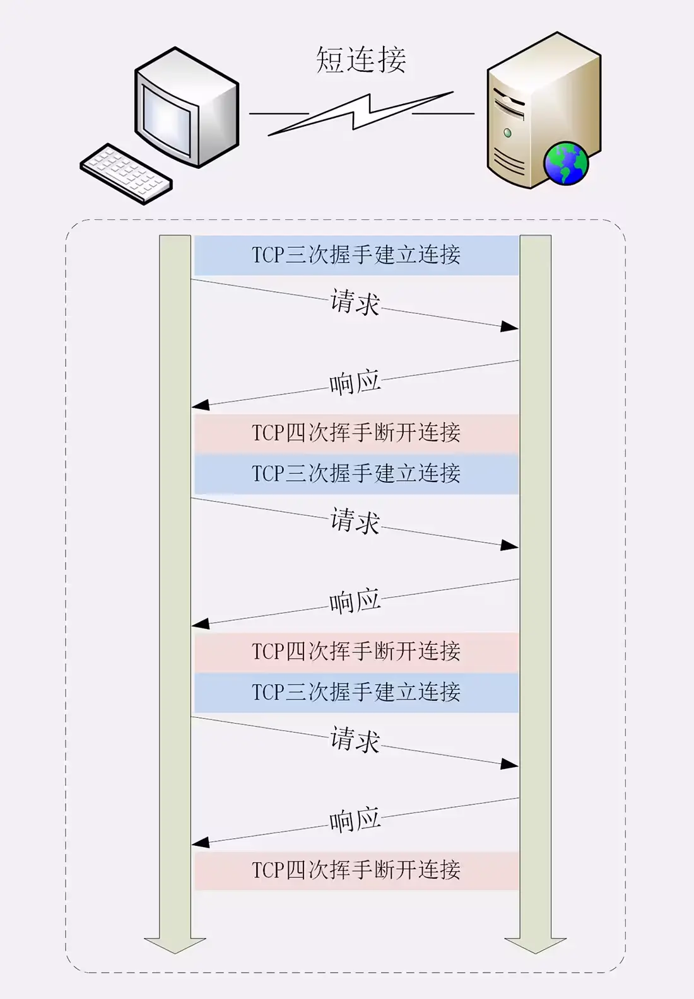

## 长连接

- 长连接也叫持久连接、keep-alive、连接复用。
- 思路：一条 TCP 连接复用多个请求，把建连成本摊薄。
- 好处：整体 RTT 浪费更少，传输效率更高。

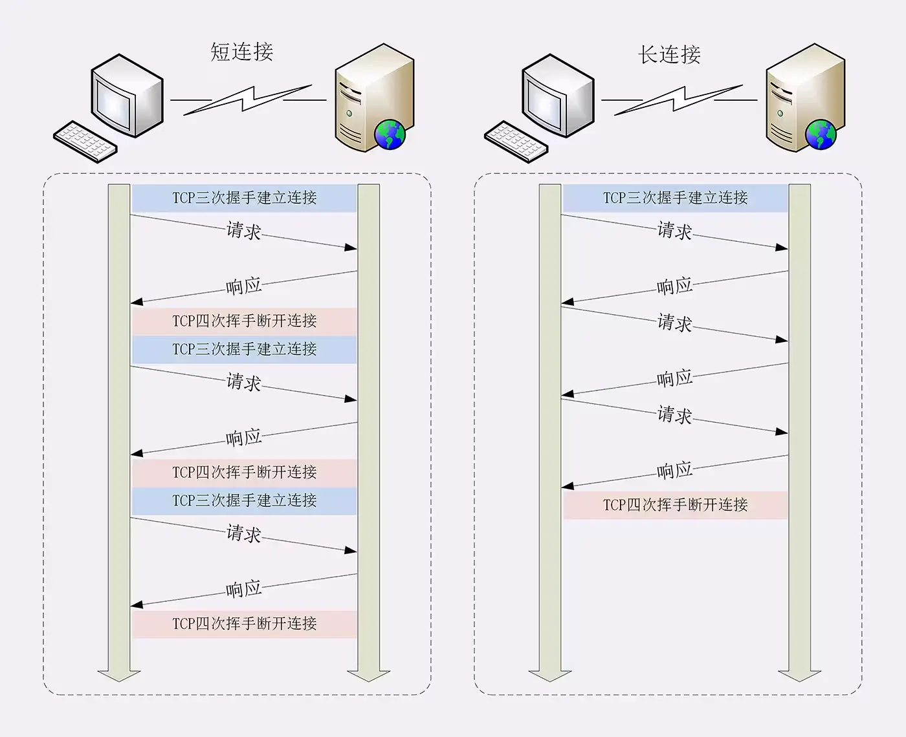

- 记忆点：请求越多，长连接收益越明显。

## 连接相关的头字段

- HTTP/1.1 默认启用长连接，不必额外显式声明。

- 服务端 `Connection: keep-alive`

- 用于表示当前连接希望继续复用。
- 但长连接会占用服务器资源，因此不能无限保持。

- 客户端 `Connection: close`

- 告诉服务器本次通信后关闭连接。

- 服务端

服务器端也可以通过策略主动关闭长连接，例如：
1. 使用“keepalive_timeout”指令，设置长连接的超时时间，如果在一段时间内连接上没有任何数据收发就主动断开连接，避免空闲连接占用系统资源。
2. 使用“keepalive_requests”指令，设置长连接上可发送的最大请求次数。比如设置成 1000，那么当 Nginx 在这个连接上处理了 1000 个请求后，也会主动断开连接。

- `Keep-Alive: timeout=value` 也能辅助约定超时时间，但约束力有限。

## 请求-应答模型导致队头阻塞

- 队头阻塞与短连接、长连接无关，根因在 HTTP/1.1 的串行请求-应答模型。
- 前面的请求慢，后面的请求就只能排队等待。
- 结果：一个慢请求拖慢整条队列。

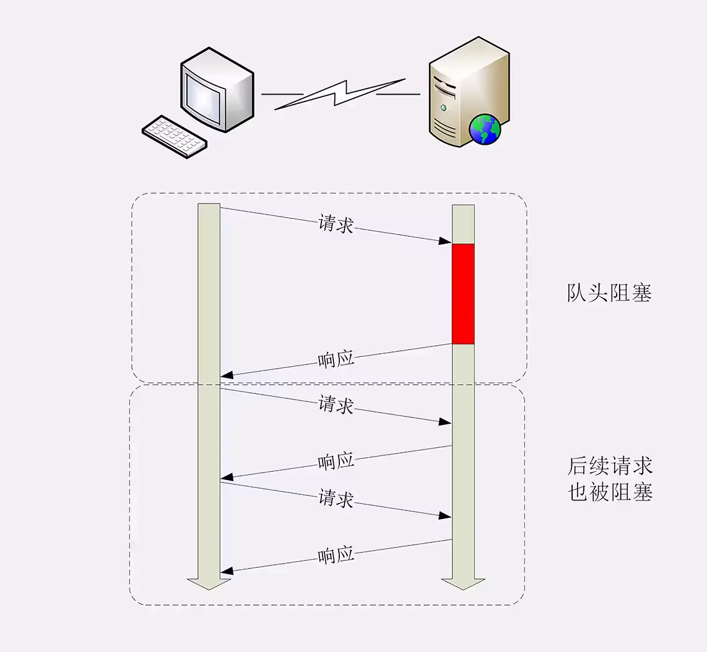

- “并发连接”（concurrent connections）

- HTTP/1.1 无法彻底解决队头阻塞，只能缓解。
- 常见办法：对同一域名建立多个并发连接。
- 代价：连接数过多会压垮服务器资源。

- “域名分片”（domain sharding）技术

- 把资源拆到多个子域上，让浏览器并行下载更多内容。

# HTTP 的重定向与跳转

- 页面跳转分两类：
- 主动跳转：用户点击链接后发起新请求。
- 被动跳转：服务器返回重定向响应，浏览器自动跳到新地址。

## 重定向的过程

- 实验里访问 `/18-1`，服务器会返回 `302` 并跳到 `/index.html`。

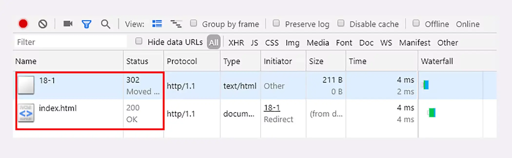

- 一次重定向通常对应两次请求。
- 用户通常感觉不到中间过程。

第一个请求返回的响应报文：

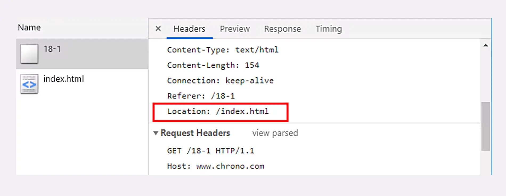

- 关键字段是 `Location`，它告诉浏览器下一跳去哪里。
- 浏览器收到 `301/302` 后，会读取 `Location` 再发起新请求。
- `Location` 可以是绝对 URI，也可以是相对 URI。

例如，如果想跳转到 Nginx 官网，就必须在“nginx.org”前把“http://”都写出来，否则浏览器会按照相对 URI 去理解，得到的就会是一个不存在的 URI“http://www.chrono.com/nginx.org”

~~~
http://www.chrono.com/18-1?dst=nginx.org           # 错误
http://www.chrono.com/18-1?dst=http://nginx.org    # 正确
~~~

## 重定向状态码

- 最常见的重定向状态码是 `301` 和 `302`。
- `301`：永久重定向，浏览器和搜索引擎都倾向记住新地址。
- `302`：临时重定向，下次通常还会继续访问原地址。
- 其他常见补充：

- 303 See Other：类似 302，但要求重定向后的请求改为 GET 方法，访问一个结果页面，避免 POST/PUT 重复操作；
- 307 Temporary Redirect：类似 302，但重定向后请求里的方法和实体不允许变动，含义比 302 更明确；
- 308 Permanent Redirect：类似 307，不允许重定向后的请求变动，但它是 301“永久重定向”的含义。

- `303/307/308` 语义更精细，但使用前最好确认浏览器和服务端兼容性。

## 重定向的应用场景

- 重定向常见场景：
- 域名迁移、目录改版、协议升级。
- 系统维护、服务降级、临时切流。
- 多个入口统一跳转到主站。
- 选择原则：永久变化用 `301`，临时变化用 `302`。

## 重定向的相关问题

- 重定向的两个主要问题：
- 性能损耗：一次跳转通常要多一次请求。
- 循环跳转：可能出现 `A -> B -> C -> A` 的死循环。
- 结论：重定向要适度使用，并避免错误配置。

# HTTP 的 Cookie 机制

- Cookie 的核心作用：给无状态的 HTTP 补上“记住用户”的能力。
- 本质上，它是服务器让浏览器代为保存的一小段身份数据。
- 需要时浏览器再把这段数据带回服务器。

## 工作过程

- Cookie 工作依赖两个头字段：`Set-Cookie` 和 `Cookie`。
- 第一次访问时，服务器通过 `Set-Cookie` 下发身份标识。
- 浏览器保存后，后续请求会自动在 `Cookie` 头里带回去。
- 服务器读到 Cookie 后，就能识别用户并维持状态。
- 一个站点可以设置多个 Cookie，浏览器回传时通常会用 `;` 拼在一起。

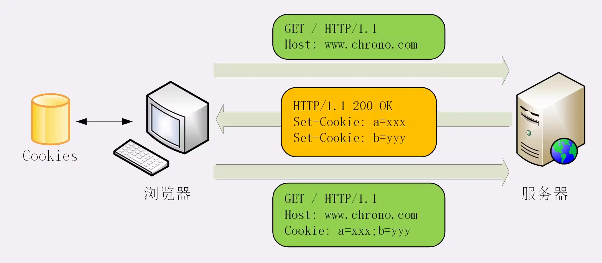

- Cookie 由浏览器存储，不是操作系统统一存储。
- 所以它天然带有“浏览器绑定”特征。

在实验环境里，你可以用 Chrome 访问 URI“/19-1”，实地看一下 Cookie 工作过程。

首次访问时服务器会设置两个 Cookie。

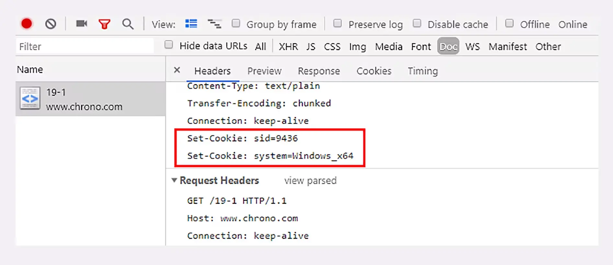

然后刷新这个页面，浏览器就会在请求头里自动送出 Cookie，服务器就能认出你了。

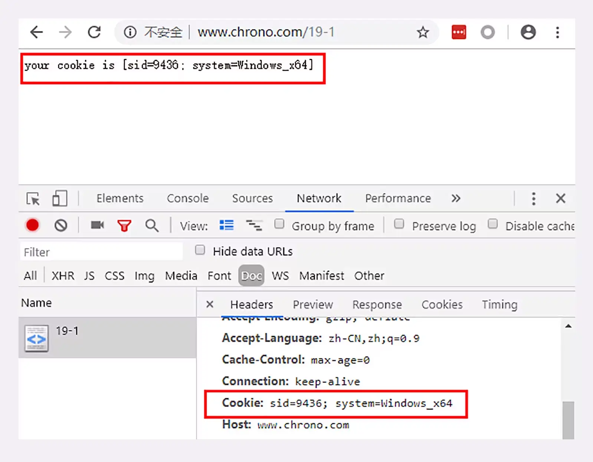

如果换成 Firefox 等其他浏览器，因为 Cookie 是存在 Chrome 里的，所以服务器就又“蒙圈”了，不知道你是谁，就会给 Firefox 再贴上小纸条。

## Cookie 的属性

Cookie 往往携带身份相关信息，所以必须用属性控制生命周期、作用域和安全性。

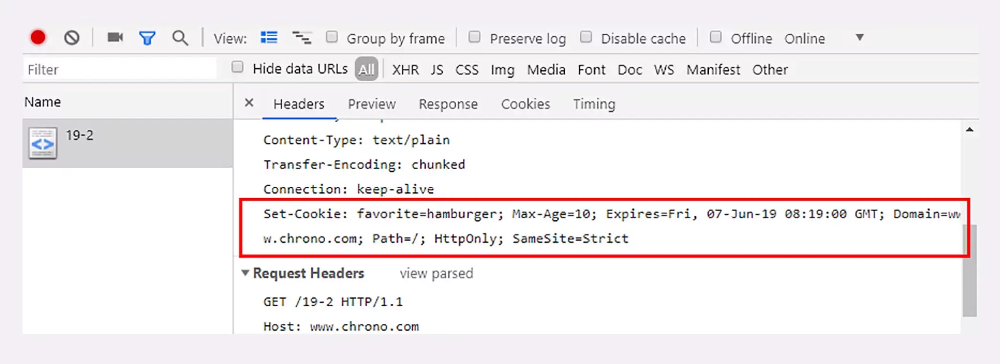

- 常见生命周期属性：
- `Expires`：绝对过期时间。
- `Max-Age`：相对过期时间，通常优先级更高。
- 常见作用域属性：
- `Domain`：限制域名范围。
- `Path`：限制路径范围。
- 常见安全属性：
- `HttpOnly`：禁止 JS 读取，防止 XSS 窃取。
- `Secure`：只允许通过 HTTPS 传输。
- `SameSite`：限制跨站发送，防 CSRF。
- 可以用浏览器开发者工具查看 Cookie 及其属性。

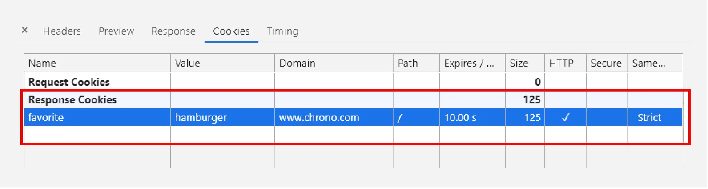
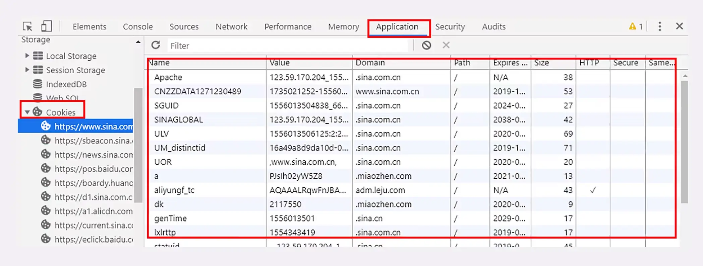

## Cookie 的应用
- Cookie 最常见的用途是登录态保持和身份识别。
- 服务器可借此记录用户会话、购物车、浏览行为等状态。
- 另一个常见用途是广告跟踪，尤其是第三方 Cookie。
- 这也是 Cookie 引发隐私争议的重要原因。

# HTTP 缓存控制

缓存控制的目标很简单：尽量复用已经拿到的资源，减少重复请求、重复传输和页面等待时间。

- 记忆点：HTTP 链路上的多个环节都可能有缓存，不只有浏览器缓存。

## 缓存的两种思路

- 强缓存：浏览器直接使用本地缓存，不向服务器发请求。
- 协商缓存：浏览器会先问服务器“资源变了吗”，没变就返回 `304 Not Modified`。

## 常见缓存字段

- `Cache-Control`：现代缓存控制的核心字段。
- `Expires`：绝对过期时间，HTTP/1.0 风格，优先级低于 `Cache-Control`。
- `Last-Modified`：资源最后修改时间。
- `If-Modified-Since`：客户端携带上次的修改时间去做协商缓存。
- `ETag`：资源的唯一标识，可理解为内容指纹。
- `If-None-Match`：客户端携带 `ETag` 去问服务器资源是否变化。

## 常见 Cache-Control 指令

- `max-age=秒数`：在这段时间内直接使用缓存。
- `no-cache`：可以缓存，但使用前必须向服务器验证。
- `no-store`：不允许缓存。
- `must-revalidate`：缓存过期后必须去服务器重新验证。
- `public`：响应可被浏览器和代理服务器缓存。
- `private`：通常只允许浏览器缓存，不允许共享代理缓存。

## 强缓存与协商缓存的区别

- 强缓存命中：浏览器直接用本地副本，速度最快。
- 协商缓存命中：浏览器发请求，服务器返回 `304`，不再重复传输消息体。
- 协商缓存未命中：服务器返回新的资源内容，常见状态码为 `200`。

## 实战速记

- 静态资源常配 `Cache-Control: max-age=...` 提高加载速度。
- 经常变化的数据不适合长时间强缓存。
- `ETag + If-None-Match` 通常比 `Last-Modified + If-Modified-Since` 更精确。
- 看到 `304 Not Modified`，说明资源没变，浏览器应复用本地缓存。
- 浏览器自己也会发 `Cache-Control: max-age=0` 或 `no-cache`，要求重新验证资源。

## 本节小结

- 强缓存的关键是“本地直接用”。
- 协商缓存的关键是“先问服务器变没变”。
- `Cache-Control` 是缓存策略核心，`ETag` 和 `Last-Modified` 是常用校验依据。

# HTTP 的代理服务

## 代理的基本概念

- 代理位于客户端和服务器之间，代替一方与另一方通信。
- 可以把它理解成 HTTP 链路里的“中间商”。
- 对客户端来说，它像服务器；对源服务器来说，它又像客户端。
- 按位置和用途，常见有正向代理和反向代理。

## 代理的作用

- 负载均衡：把请求分发到多台后端服务器。
- 健康检查：发现故障节点后及时摘除。
- 安全防护：隐藏源站、限流、抗攻击。
- SSL/TLS 卸载：在代理层做 HTTPS 终止，减少后端加解密压力。
- 数据过滤：按策略改写请求或响应。
- 内容缓存：把热点响应缓存在代理层，减少源站压力。

## 代理相关头字段

- `Via`：标记报文经过了哪些代理节点。
- 多级代理会把 `Via` 追加成列表，方便追踪链路。
- `X-Forwarded-For`：记录客户端真实 IP，可能是链式地址。
- `X-Real-IP`：常用于记录单个真实客户端 IP。
- `X-Forwarded-Host`：记录原始请求中的 Host。
- `X-Forwarded-Proto`：记录原始协议是 HTTP 还是 HTTPS。
- 记忆点：这些头字段的目标，是把被代理后丢失的原始客户端信息补回来。

## 代理协议

- 仅靠 `X-Forwarded-*` 头字段有两个问题：
- 代理必须解析并修改 HTTP 头，成本更高。
- 遇到 HTTPS 时，原始报文未必方便直接修改。
- 所以还有专门的 `PROXY protocol`。
- 它由 HAProxy 推广，常见有 v1 和 v2 两个版本。
- v1 是明文格式，会在 HTTP 报文前增加一行代理信息。
- 这一行通常包含：协议类型、客户端地址、服务端地址、客户端端口、服务端端口。
- 这样后端先读第一行，就能拿到真实来源信息，而不必深入解析完整 HTTP 头。

# HTTP 的缓存代理

## 缓存代理是什么

- 缓存代理 = 带缓存能力的代理服务器。
- 它会把源站响应暂存下来，再把缓存结果分发给后续客户端。
- 本质仍然是“空间换时间”的性能优化。
- 好处：降低源站压力、减少重复回源、缩短用户等待时间。

## 缓存代理的控制字段

- 浏览器缓存和代理缓存都受 `Cache-Control` 影响，但关注点不完全一样。
- `private`：只允许浏览器这类私有缓存保存，不允许代理缓存。
- `public`：允许代理等共享缓存保存响应。
- `s-maxage`：专门给共享缓存用的过期时间，优先于 `max-age`。
- `no-transform`：不允许代理擅自改动响应内容，例如压缩、转码、转图片格式。
- 缓存代理同样会配合 `Last-Modified`、`ETag`、条件请求等机制工作。
- 记忆点：`max-age` 更偏通用，`s-maxage` 更偏共享缓存。

## 缓存代理的风险与清理

- 缓存代理也会带来副作用：
- 可能继续分发已经过期或错误的数据。
- 可能把不该缓存的内容缓存下来。
- 源站资源更新后，旧缓存如果不刷新就会造成脏数据。
- 常见处理方式：
- 让缓存自然过期。
- 主动刷新到最新版。
- 主动删除指定缓存条目。
- 实践里常见做法是使用 `PURGE` 之类的自定义方法清理代理缓存。

## 本节小结

- 代理服务扩展了 HTTP 的处理能力，典型价值是转发、保护、均衡和加速。
- `Via`、`X-Forwarded-*`、`PROXY protocol` 解决的是“真实来源信息传递”问题。
- 缓存代理是代理服务和缓存机制的结合体，核心目标仍然是减轻源站压力并加速访问。

# HTTPS 与 TLS

## HTTPS 是什么

- HTTPS 不是新应用层协议，本质还是 HTTP。
- 它只是把下层传输从“HTTP over TCP”变成了“HTTP over TLS over TCP”。
- 所以 HTTPS 的语义、方法、状态码、头字段仍然沿用 HTTP。
- 真正新增的是安全能力，而不是请求-响应模型本身。
- 记忆点：HTTPS = HTTP + TLS。

## 通信安全的四个目标

- 机密性：内容不能被旁路窃听。
- 完整性：内容不能被中途篡改而不被发现。
- 身份认证：通信双方要能确认对方身份。
- 不可否认：发送者事后不能轻易否认自己发过消息。
- HTTP 明文传输，天然难以满足这些要求，这就是 HTTPS 出现的根本原因。

## 对称加密与非对称加密

- 对称加密：加密和解密用同一把密钥。
- 优点：速度快，适合大量数据传输。
- 缺点：密钥分发困难，一旦泄露就失去意义。
- 常见算法：`AES`、`ChaCha20`。
- 非对称加密：公钥加密，私钥解密，或私钥签名、公钥验证。
- 优点：能解决密钥交换问题。
- 缺点：速度慢，不适合直接加密大量业务数据。
- 常见算法：`RSA`、`ECC`。
- TLS 实际采用的是“混合加密”：先用非对称手段安全协商密钥，再用对称加密传输正文。

## 摘要算法数字签名与证书

- 摘要算法会把任意长度数据压缩成固定长度“指纹”。
- 只要原文改一点，摘要通常就会明显变化，所以它适合做完整性校验。
- 常见摘要算法：`SHA-256`、`SHA-384`。
- 数字签名 = 用私钥对摘要做签名，再让对方用公钥验证。
- 这样可以同时解决“内容没被改”和“消息确实来自某个私钥持有者”。
- 但还有一个问题：公钥本身是否可信。
- 证书就是把“域名/主体信息 + 公钥 + 颁发者信息 + 签名”打包后的身份证明。
- 浏览器会沿着 CA 信任链校验证书，直到受信任的根证书。
- 证书也可能失效，所以还会有 `CRL`、`OCSP` 这类吊销检查机制。

## TLS1.2 握手过程

- 建立 HTTPS 连接时，先 TCP 三次握手，再 TLS 握手，最后才传 HTTP 数据。
- `ClientHello`：客户端发支持的版本、密码套件、随机数。
- `ServerHello`：服务端确认版本、密码套件，并返回自己的随机数和证书。
- 客户端验证证书是否合法、域名是否匹配、信任链是否完整。
- 如果使用 RSA 类传统握手，客户端还会生成 `Pre-Master`，并用服务器公钥加密发过去。
- 双方结合三个关键随机量推导出会话密钥，再切换到对称加密。
- `Change Cipher Spec` 之前大多还是明文握手消息；之后进入密文通信。
- 记忆点：TLS1.2 的核心目标是“安全协商出对称密钥”。

## DHE / ECDHE 为什么能安全交换密钥

- `DH` / `DHE` 本质上不是拿来直接加密业务数据，而是拿来在公开信道里协商共享秘密。
- 它的数学基础是离散对数难题：正向计算容易，反向从公开结果倒推出私钥很难。
- 双方先约定公开参数，然后各自生成私钥，再计算出各自公钥并交换。
- 之后双方再拿“自己的私钥 + 对方的公钥”各算一次，会得到同一份共享秘密，也就是后续对称加密要用的密钥材料。
- 窃听者即使看到了公开参数和双方公钥，也通常难以在可接受时间内反推出私钥，所以算不出共享秘密。
- `DHE` 里的 `E` 是 `ephemeral`，表示私钥是临时生成、用完即丢的，这就带来了前向安全。
- 也就是说，就算攻击者未来拿到了某台机器的长期密钥，也不应该顺带解开过去所有会话。
- `ECDHE` 则是把传统 DHE 的整数域运算，换成椭圆曲线上的离散对数问题，通常能用更短密钥换来更好的安全性和性能。
- 所以现代 TLS 更偏爱 `ECDHE`：它既能做密钥交换，又有前向安全，还更适合高并发 HTTPS 场景。
- 记忆点：`DH` 解决“公开信道里怎么协商密钥”，`E` 解决“前向安全”，`EC` 解决“更高效的现代实现”。

## TLS1.3 的改进

- TLS1.3 为了兼容旧实现，表面上常会“伪装”成 TLS1.2，但真正能力靠扩展协商。
- 它大幅删减了历史包袱，移除了很多不安全或过时算法。
- 被淘汰的典型内容包括：`RC4`、`DES`、`CBC`、`MD5`、`SHA-1`、RSA 密钥交换等。
- 保留下来的主流方向是：`ECDHE`、`AES-GCM`、`ChaCha20-Poly1305`、`SHA-256/384`。
- 握手从 TLS1.2 的多次往返，缩减到 1-RTT 为主，性能更好。
- 由于使用临时密钥交换，前向安全性更强。
- 记忆点：TLS1.3 = 更少算法 + 更短握手 + 更强默认安全性。

## HTTPS 的优化手段

- HTTPS 比 HTTP 慢，主要慢在两类成本：网络往返和握手计算。
- 优先使用 `ECDHE` 套件，通常比传统 RSA 方案更适合现代 HTTPS。
- 开启 `OCSP Stapling`，避免客户端自己再去找 CA 查证书状态。
- 使用会话复用减少重复握手成本，常见手段有 `Session ID`、`Session Ticket`、`PSK`。
- TLS1.3 天然能减少一次往返，本身就是重要优化。
- 服务器、证书链、网络链路都要尽量精简，否则 TLS 之外的开销也会放大。
- 记忆点：优化 HTTPS，本质就是减少 RTT、减少证书校验额外开销、减少重复握手。

## HTTP 迁移到 HTTPS

- 趋势上，HTTP 迁移到 HTTPS 已经不是“可选增强”，而是基础要求。
- 第一步通常是申请证书，实践里常见选择是 `Let's Encrypt`。
- 服务端配置时要优先选择安全的 TLS 版本和密码套件。
- 旧 HTTP 站点通常不会立刻删除，而是保留并做 `301` 跳转到 HTTPS。
- 迁移时要留意混合内容问题：HTTPS 页面里如果继续引用 HTTP 资源，浏览器会拦截或告警。
- 登录、支付、后台、接口服务这类敏感场景应优先迁移。
- 记忆点：迁移不是只“开证书”，还包括跳转、资源链接、证书续期和安全配置。

## 本章速记

- HTTPS 解决的是 HTTP 明文、不校验、不认证的问题。
- TLS 靠混合加密、摘要、签名、证书来实现安全通信。
- TLS1.2 重点记握手流程；TLS1.3 重点记“更少算法 + 1-RTT + 前向安全”。
- HTTPS 优化的核心手段是 `ECDHE`、`OCSP Stapling`、会话复用。
- 站点迁移 HTTPS 时，至少要想到证书、套件、301 跳转、混合内容和续期管理。

# HTTP/2

## HTTP/2 的核心变化

- HTTP/2 在语义上兼容 HTTP/1.1，请求方法、URI、状态码这些概念都还在。
- 它不是“换掉 HTTP 逻辑”，而是重写了底层消息组织方式。
- HTTP/1.1 里看到的是文本报文；HTTP/2 里看到的是二进制帧。
- 头部不再原样重复发送，而是通过 `HPACK` 压缩减少冗余。
- 实践里 HTTP/2 通常和 HTTPS 一起使用，并依赖更现代的 TLS 配置。

## 帧流与多路复用

- HTTP/2 把消息拆成很多帧，帧是最小传输单位。
- 多个帧按 `Stream ID` 归类后，就组成一个“流”。
- 一个流可以理解成一次虚拟的“请求 - 应答”往返。
- 一个连接上可以并发很多流，这就是多路复用。
- 所以应用层不再像 HTTP/1.1 那样被“一个请求没完，下一个就得排队”严重限制。
- 但要注意：HTTP/2 只是缓解了应用层队头阻塞，底层 TCP 的队头阻塞并没有彻底消失。

## HTTP/2 的细节记忆点

- 建连后需要先发送连接前言，表明双方说的是 HTTP/2。
- HTTP/2 废除了传统的起始行表示法，更多信息统一放到头字段里表达。
- 流是双向的，客户端和服务器都能在流里发送帧。
- 流内部的帧必须有序，不同流之间可以交错传输。
- 流可以设置优先级，服务端可优先处理更关键的资源。
- 客户端发起的流 ID 通常是奇数，服务器发起的流 ID 通常是偶数。
- `RST_STREAM` 可用于中途取消一个流。
- 0 号流比较特殊，主要承载控制信息，不传普通业务数据。

## HTTP/2 的优劣与迁移

- 优势：头部更省、连接利用率更高、延迟更低、资源并发更自然。
- 如果站点已经升级到 HTTPS，再升级 HTTP/2 的门槛通常不高。
- 通过 `ALPN`，客户端和服务器可以在 TLS 阶段协商是否使用 HTTP/2。
- 对高并发、多静态资源页面，HTTP/2 的收益通常更明显。
- 但在弱网环境下，TCP 层队头阻塞仍可能拖累表现，这也是 HTTP/3 继续演进的原因。

## 本章速记

- HTTP/2 保留 HTTP 语义，但把报文改造成“二进制帧 + 流”。
- `HPACK` 解决头部重复传输问题，多路复用解决 HTTP/1.1 的应用层串行瓶颈。
- HTTP/2 的流是虚拟概念，本质是同一连接里按 ID 区分出来的多个双向传输序列。
- HTTP/2 没有彻底消灭队头阻塞，TCP 层阻塞仍在。

# HTTP/3 与 QUIC

## 为什么需要 HTTP/3

- HTTP/2 已经在应用层做了很多优化，但它仍然跑在 TCP 上。
- 只要 TCP 某个报文段丢失，后续数据仍会被卡住，这就是传输层队头阻塞。
- 所以 HTTP/3 继续往下走，不再基于 TCP，而是选择了 QUIC。

## QUIC 的关键特性

- QUIC 建立在 UDP 之上，但自己实现了可靠传输能力。
- 它把 TLS1.3 融进了协议内部，默认就是加密通信。
- QUIC 支持 `0-RTT` / 更快建连，适合减少首次和重复连接开销。
- QUIC 使用连接 ID 标识会话，不再强绑定“IP + 端口”。
- 这让它具备连接迁移能力，例如移动网络切换时连接更容易续上。
- QUIC 也有流的概念，而且分为单向流和双向流。

## HTTP/3 的工作方式

- HTTP/3 可以看作“HTTP 语义 + QUIC 传输”。
- 它继承了 HTTP/2 的多路复用思路，但把底层阻塞问题进一步解决掉了。
- 在弱网、移动网络、高丢包环境下，HTTP/3 往往比 HTTP/2 更稳。
- HTTP/3 没有像 HTTP/1.1 那样固定一个广为人知的新端口习惯，服务发现常依赖 `Alt-Svc`。
- 记忆点：HTTP/2 主要解决应用层并发问题，HTTP/3 继续解决传输层阻塞问题。

## 本章速记

- HTTP/3 基于 QUIC，QUIC 基于 UDP 但提供可靠传输。
- QUIC 内置 TLS1.3、支持更快握手、支持连接迁移。
- HTTP/3 真正把 HTTP/2 没解决完的 TCP 队头阻塞问题继续往下处理了。

# HTTP/3 实验版观察

## 当前落地现状

- HTTP/3 在正式标准落地前，业界通常会先基于草案做实验实现。
- 比较典型的参与者是 Cloudflare 和 Nginx：前者做过基于 QUIC 的实现，后者后来也推出了官方 `http_v3_module`。
- 实验实现往往不会追最新草案，而是先跟一个相对稳定的版本，例如 `h3-29` 这类标识。
- 所以看到“支持 HTTP/3”不一定等于“支持最新正式版”，更多是说明链路已经能跑通 QUIC + HTTP/3。

## 如何快速验证

- 测试 HTTP/3 时，浏览器版本很关键，通常要用较新的 Chrome 或 Firefox。
- 有些环境下浏览器默认不会积极启用 QUIC，需要在实验开关里打开，或者带参数启动浏览器。
- 除了看页面上的提示标识，更可靠的方式是打开开发者工具，看 `Protocol` 列。
- 如果看到 `h2`，说明还是 HTTP/2；如果看到 `h3` 或类似 `h3-29`，才说明真正走到了 HTTP/3。
- 一些测试站点会专门提供 QUIC/HTTP/3 验证页面，适合做快速尝鲜和联通性确认。

## 抓包时看什么

- HTTP/3 建立在 QUIC 之上，所以抓包时你先看到的通常是 UDP，而不是 HTTP/2/HTTPS 常见的 TCP。
- 握手阶段能看到 QUIC 的连接建立过程，但应用数据大多已经被加密，不能再像早期 HTTP 那样直接肉眼读正文。
- 所以抓包分析的重点，不再是“报文内容明文长什么样”，而是“有没有走 UDP/QUIC、协商是否成功、版本是否匹配”。
- 实战里常会结合浏览器开发者工具和 Wireshark 一起看：前者确认协议层，后者确认传输层。

## 本章速记

- HTTP/3 的实验实现常常先跟随草案版本，不一定是最终标准。
- 验证 HTTP/3，最实用的是看浏览器 `Protocol` 列是否出现 `h3`。
- 抓包时的一个大变化是：底层从 TCP 变成 UDP/QUIC。

# WebSocket

## 为什么会有 WebSocket

- HTTP 天然是请求-应答模型，服务端很难主动持续向客户端推送消息。
- 做实时聊天、在线协同、行情推送、游戏状态同步时，HTTP 轮询效率偏低。
- WebSocket 就是为浏览器里的实时双向通信而出现的。

## WebSocket 的特点

- WebSocket 是全双工协议，连接建好后，客户端和服务器都可以主动发消息。
- 它像是在 TCP 外面包了一层更适合浏览器实时通信的轻量协议。
- URI 方案使用 `ws` 和 `wss`，对应明文和加密版本。
- 默认端口通常沿用 `80` 和 `443`。
- WebSocket 也使用二进制帧，但结构比 HTTP/2 简单得多。
- 一个重要记忆点：客户端发往服务器的数据必须做掩码处理，服务器回客户端的数据通常不用掩码。

## WebSocket 的握手过程

- WebSocket 不是直接脱离 HTTP 开始工作的，它通常先借 HTTP 完成握手。
- 客户端先发一个 `GET` 请求，并在头字段里声明要升级协议。
- 关键头字段包括：`Connection: Upgrade` 和 `Upgrade: websocket`。
- 还会带上 `Sec-WebSocket-Key` 与 `Sec-WebSocket-Version` 等字段。
- 服务端如果同意升级，会返回 `101 Switching Protocols`。
- 从这一刻开始，双方就不再按普通 HTTP 报文通信，而是切换到 WebSocket 帧。

## 本章速记

- WebSocket 解决的是浏览器里“实时双向通信”问题。
- 它借 HTTP 完成握手，再升级成独立的全双工长连接协议。
- 看到 `101 Switching Protocols`、`Upgrade: websocket`，就要想到协议升级握手。
- `ws/wss` 类比 `http/https`，而客户端消息必须掩码是高频考点。

# Nginx

## 为什么 Nginx 很常见

- Nginx 是高性能 Web 服务器，也是非常常见的反向代理和负载均衡组件。
- 它经常出现在 HTTP 服务的最前面，负责接入流量、转发请求、静态资源分发、SSL 卸载等工作。
- 复习时可以把它理解成“HTTP 服务入口层”的代表。

## Nginx 的核心工作方式

- Nginx 整体采用 `master + worker` 架构：`master` 负责管理，`worker` 负责实际处理请求。
- 它依赖事件驱动和 I/O 多路复用模型，在 Linux 上常见实现就是 `epoll`。
- 这种模型适合高并发、低阻塞场景，所以能以较少进程支撑大量连接。
- Nginx 内部处理请求很像责任链或阶段流水线，请求会在多个 phase 中被逐步处理。
- 常见模块能力可以记成几类：`handler` 负责内容处理，`filter` 负责响应过滤，`upstream` 负责代理上游，`balance` 负责负载均衡。

## 本章速记

- Nginx = 高性能 Web 服务器 + 反向代理 + 负载均衡。
- 核心记忆点：`master/worker`、事件驱动、`epoll`、阶段式处理。
- 面试里如果问“为什么 Nginx 扛并发”，就答事件驱动 + I/O 多路复用 + 多 worker。

# OpenResty

## 为什么需要 OpenResty

- Nginx 很强，但传统配置主要偏静态，复杂业务逻辑写起来不够灵活。
- 如果改了配置或模块，往往还需要 reload 或重启，动态能力有限。
- OpenResty 就是在 Nginx 基础上进一步增强“可编程能力”的方案。

## OpenResty 的核心特点

- OpenResty 可以看作 “Nginx + Lua + 大量实用模块/库”。
- 它把 Lua 嵌进 Nginx 的处理流程里，让开发者可以在请求各阶段插入更灵活的逻辑。
- 这让网关鉴权、灰度发布、限流、动态路由、接口聚合等中间层能力更容易实现。
- OpenResty 的运行模型依旧强调同步非阻塞，本质上还是事件驱动，只是借助协程把逻辑写得更像同步代码。
- 一个很实用的记忆点是：OpenResty 支持更灵活的动态脚本更新，热加载能力比纯 Nginx 配置更强。

## 本章速记

- OpenResty = 更灵活、可编程的 Nginx。
- 核心抓手是 `Lua`、阶段钩子、协程、热加载。
- 它常被拿来做 API 网关、业务网关和中间层逻辑编排。

# WAF

## WAF 是什么

- WAF 是 Web Application Firewall，即 Web 应用防火墙。
- 它主要工作在 HTTP 这一层，可以把它理解成“七层流量的入侵检测与防护系统”。
- WAF 关注的不是普通网络转发，而是恶意 HTTP 请求，例如代码注入、异常参数、恶意扫描、DDoS 等攻击行为。

## WAF 的能力与代价

- WAF 的基本思路是对 HTTP 请求和响应做规则匹配、特征识别和拦截处理。
- 常见实现可以记住 `ModSecurity`，它本质上可以拆成“规则引擎 + 规则集”。
- WAF 可以部署在反向代理前后，也常和 Nginx、CDN 组合使用。
- 它的收益是提升安全性，但代价是会额外消耗 CPU、增加处理延迟、降低部分吞吐能力。
- 所以 WAF 永远是安全与性能之间的权衡，不是零成本能力。

## 本章速记

- WAF 保护的是 Web 应用层，不是单纯的网络层防火墙。
- 高频关键词：七层防护、规则引擎、`ModSecurity`、拦截注入与恶意请求。
- 记住副作用：更安全，但通常会更耗资源、略降性能。

# CDN

## 为什么需要 CDN

- 用户和源站物理距离远时，HTTP 访问就会受到时延、带宽、跨运营商链路等问题影响。
- CDN 的核心目标就是把内容尽量推近用户，减少长距离回源访问。
- 所以它本质上是在做“中间一公里”的传输优化和内容分发优化。

## CDN 的核心组成

- CDN 可以粗略理解成“调度系统 + 缓存系统”。
- 调度大脑通常是 `GSLB`，它通过 DNS 负载均衡等手段，把用户请求引导到更合适的节点。
- 真正承载内容的是分布式缓存节点，这部分可以看作 CDN 的“心脏”。
- 节点命中缓存时直接返回内容；未命中时就需要向源站取回资源，这个过程叫“回源”。
- 现代 CDN 往往不只做静态加速，还会叠加 SSL 加速、内容优化、防盗链、WAF 等能力。

## CDN 的关键指标

- `命中`：用户请求的数据直接在 CDN 节点上找到并返回。
- `回源`：节点没有缓存，需要去源站重新拉取内容。
- 高频指标就是命中率和回源率：命中率越高，回源率通常越低，整体性能和源站压力也越好。

## 本章速记

- CDN 解决的是“用户离源站太远”带来的访问慢问题。
- `GSLB` 是调度大脑，缓存节点是核心载体。
- 高频术语：命中、回源、命中率、回源率。

# HTTP 性能优化

## 先看指标，不要上来就调参

- HTTP 性能优化不是单一技巧，而是“服务器性能 + 客户端性能 + 传输链路性能”一起看。
- 服务端常看四类指标：吞吐量、并发数、响应时间、资源利用率。
- 客户端最核心的感知指标是延迟，浏览器里常会拆成排队、DNS、TCP 建连、TLS 握手、请求发送、`TTFB`、内容下载等阶段。
- `TTFB` 就是首字节时间，通常可以粗略反映“服务端处理 + 网络传输”的综合耗时。
- 传输链路常被记成“第一公里”“中间一公里”“最后一公里”，实际更容易优化的是前两段。
- 复习时要先判断瓶颈在哪一段，再决定是调后端、调前端资源，还是调网络链路。

## 常见优化抓手

- 降低重复请求成本：优先用强缓存和协商缓存，让浏览器少发请求、少传数据。
- 降低跨地域访问成本：把静态资源和热点内容放到 CDN，就近返回，减少回源。
- 降低传输体积：压缩文本资源，精简 HTML/CSS/JS，图片做格式和体积优化。
- 降低请求数量：在 HTTP/1.1 里可以合并资源、减少碎片化请求；但到了 HTTP/2，不要机械沿用所有“合并一切”的旧技巧。
- 降低建连成本：复用长连接，减少不必要的 TCP/TLS 握手，必要时结合预解析、预连接等手段。
- 降低服务端处理时间：慢 SQL、慢接口、阻塞逻辑、同步串行调用，都会直接拉高 `TTFB`。
- 降低协议层损耗：HTTPS 可做证书与会话复用优化，进一步可借助 HTTP/2、HTTP/3 改善并发与阻塞问题。
- 降低重定向和代理跳数：多一次跳转、回源、转发，往往就多一段延迟。

## 排查思路速记

- 如果主要耗时在 `DNS Lookup`，先看 DNS 解析、域名部署和本地缓存命中。
- 如果主要耗时在 `Initial connection` 或 `SSL`，先看建连次数、长连接复用、TLS 配置与跨地域访问距离。
- 如果主要耗时在 `TTFB`，优先怀疑后端处理、数据库、缓存命中率、上游依赖和网关链路。
- 如果主要耗时在 `Content Download`，优先怀疑资源体积过大、压缩不足、图片过重或带宽受限。
- 如果大量时间耗在浏览器排队，往往是请求太碎、连接数受限，或者 HTTP/1.1 并发能力不够。
- 所以性能优化不是“只调服务器”或者“只改前端”，而是要顺着瀑布图逐段定位。

## 本章速记

- 性能优化先分三层：服务端、客户端、链路。
- 服务端重点看吞吐量、并发数、响应时间、资源利用率；客户端重点看延迟。
- 高频术语：`TTFB`、第一公里、中间一公里、最后一公里。
- 最常见抓手就是缓存、压缩、CDN、减少请求、复用连接、升级 HTTP/2 或 HTTP/3。

# 实验环境补充

## 为什么很多人改用 Docker

- HTTP 实验环境最容易卡住人的，不是协议本身，而是操作系统差异、路径问题、权限问题、端口冲突。
- 所以很多教程后来都会改用 Docker，把操作系统、OpenResty、示例代码和常用工具一起打进镜像。
- 这样做的好处是“开箱即用”：宿主机只要能跑 Docker，实验环境就更稳定，复现成本也更低。
- 这类镜像里通常不只会放服务程序，还会顺手放进 `curl`、`telnet`、`tcpdump`、`git`、编辑器等调试工具。
- 面试里可以把它理解成：Docker 不是 HTTP 的一部分，但它能显著降低学习和验证 HTTP 的环境成本。

## 最小操作清单

- 先准备 Docker 运行环境，Windows/macOS 常见是 Docker Desktop，Linux 常见是安装 Docker Engine。
- 然后拉取镜像，例如课程环境就可以用 `docker pull` 获取现成镜像。
- 再通过 `docker run` 启动容器，把需要的端口映射出来，必要时再进入容器做调试。
- 排查时常用的不是复杂编排，而是几个基础命令：看镜像、看容器、进容器、查看端口映射。
- 如果本机环境总出问题，优先考虑容器化；如果只是偶尔跑几个例子，宿主机直接搭也未必不行。

## 本章速记

- Docker 的价值不是“更高级”，而是“减少环境差异”。
- 容器镜像可以把系统、服务、代码、调试工具一次打包。
- 学 HTTP 时，Docker 主要解决端口、权限、依赖版本、路径这类非协议问题。
