- [网络安全主要内容](#网络安全主要内容)
- [相关操作](#相关操作)
- [常见的基础概念](#常见的基础概念)
  - [windows 网络相关命令](#windows-网络相关命令)
  - [wireshark 常用过滤语法](#wireshark-常用过滤语法)
- [Vmware相关](#vmware相关)
  - [Vmware虚拟机网上模式](#vmware虚拟机网上模式)
- [互联网发展史](#互联网发展史)
  - [将两台设备连接的物理介质](#将两台设备连接的物理介质)
    - [1. 只用网线连接两台电脑](#1-只用网线连接两台电脑)
    - [2. 中继器](#2-中继器)
    - [3. 集线器](#3-集线器)
    - [4. 网桥](#4-网桥)
    - [5. 交换机](#5-交换机)
    - [6. 路由器](#6-路由器)
    - [7. 无线AC/AP](#7-无线acap)
    - [8. 防火墙](#8-防火墙)
    - [9. QOS(Quality of service)流量质量保证](#9-qosquality-of-service流量质量保证)
  - [常见的网络架构](#常见的网络架构)
    - [1. 家庭Soho网络](#1-家庭soho网络)
    - [2. 小型创业公司网络](#2-小型创业公司网络)
    - [3. 园区网](#3-园区网)
    - [4. 政务网](#4-政务网)
    - [5. 数据中心](#5-数据中心)
    - [6. 电信网/互联网](#6-电信网互联网)
- [TCP/IP协议栈](#tcpip协议栈)
  - [TCP/IP协议栈](#tcpip协议栈-1)
    - [概述](#概述)
    - [OSI模型](#osi模型)
    - [数据封装与解封装（发送接收过程）](#数据封装与解封装发送接收过程)
    - [OSI数据封封装和解封装](#osi数据封封装和解封装)
  - [Enthernet协议](#enthernet协议)
  - [IP协议](#ip协议)
    - [IP地址](#ip地址)
      - [IP地址概述](#ip地址概述)
      - [IP子网分类](#ip子网分类)
      - [IP路由汇总](#ip路由汇总)
  - [ARP协议](#arp协议)
  - [ICMP协议](#icmp协议)
  - [UDP协议](#udp协议)
  - [DHCP协议](#dhcp协议)
  - [TCP协议](#tcp协议)
  - [Telnet](#telnet)
  - [互联网攻防技术](#互联网攻防技术)
    - [ARP攻击原理](#arp攻击原理)
    - [ARP 防御原理](#arp-防御原理)
- [交换机相关技术](#交换机相关技术)
  - [交换机结构](#交换机结构)
  - [设备基础互联](#设备基础互联)
  - [GNS3操作](#gns3操作)
    - [IOS常用命令](#ios常用命令)
    - [配置Telnet服务器](#配置telnet服务器)
    - [ISO进阶操作](#iso进阶操作)
      - [路由器密码重置](#路由器密码重置)
      - [管理配置](#管理配置)
- [路由技术](#路由技术)
  - [静态路由技术](#静态路由技术)
    - [静态路由](#静态路由)
      - [默认路由](#默认路由)
      - [浮动路由](#浮动路由)
      - [动态路由](#动态路由)
  - [动态路由协议](#动态路由协议)
    - [RIP](#rip)
    - [EIFRP](#eifrp)

# 网络安全主要内容

# 相关操作

使用以下命令来登录国际上的一台路由器
~~~
telnet route-server.ip.att.net
~~~

# 常见的基础概念

基础概念：IP地址、子网掩码、IP地址分类、子网、VLSM、超网、主类网络、子网划分、路由汇总/聚合

IP地址分类

- A. 0-127(1-126) --------/8  主机数量：2^24-2
- B. 128-191      --------/16 主机数量：2^16-2
- C. 192-223      --------/24 主机数量：2^8-2
- D. 224-235 =>组播网络
- E. 240-255 =>科学实验

子网掩码表达网络的大小
128 + 64 * 2^8 + 32 * 2^16 = 2113664

将一具网络划分成多个网络 -&gt; 子网划分

>例
>10.0.0.0/8 --主类网
>划分成2个子网，划分出来的叫子网：
>
>10.0.0.0/9
>
>10.128.0.0/9
>
>也可以划分成4个子网
>
>10.0.0.0/10
>
>10.64.00.0/10
>
>10.128.0.0/10
>
>10.192.0.0/10

VLSM 可变长子网掩码

以前只能配成x.x.x.x/8 /16 /24

将多个网络变成1个网络 -- 路由的概念

## windows 网络相关命令

- ping 探测目的主机是否有问题，探测本地到目的的延迟等

- Traceroute/Tracert 实现链路连通性测试和链路追踪，查看通过的所有路由

- ipconfig /all 获取完整的windows网络信息

- ipconfig /release   释放被分配到的IP(DHCP Release)
- ipconfig /renew     向路由器请求，以重新获取一个IP(DHCP 获取IP)

## wireshark 常用过滤语法

# Vmware相关

## Vmware虚拟机网上模式 
1. NAT地址翻转模式

可以访问互联网，共享真机的IP地址

2. Bridge桥接模式

可以访问互联网，共享各自的IP地址/MAC地址

3. Host-Only主机模式

不可访问互联网

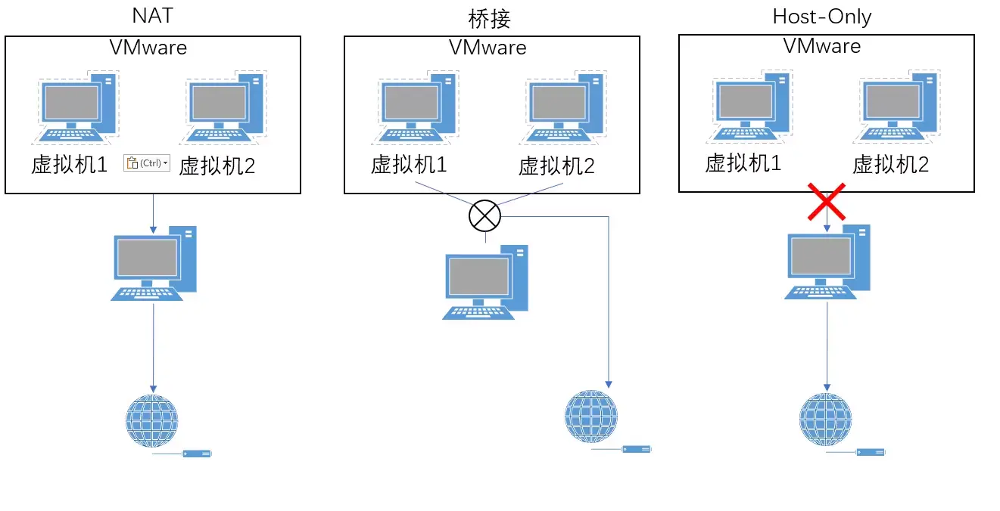

# 互联网发展史
    内容：
	- 了解互联网的发展过程
    - 了解联网设备的功能
    - 能用网络图标绘制网络拓扑

## 将两台设备连接的物理介质

在网络诞生之前，电脑之间都是单机运行，没有网卡、没有网线、没有协议栈，数据传输主要通过软盘、光盘等介质。

### 1. 只用网线连接两台电脑

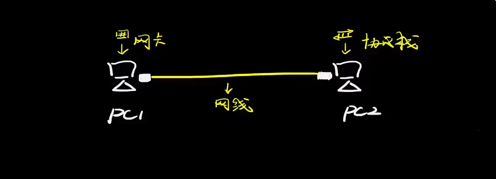

①「网线+网卡+协议栈」三要素，是组成“最小单元网络”的基础，缺一不可。

②网线提供物理介质，承载比特流/电信号。（类似电话线承载语音流/模拟信号）

③网卡进行数据处理，例如将电脑磁盘上的数据/字节转换为网线上的电流/比特，将比特流转换为数据。

④协议栈作为沟通语言，实现通信过程中的数据解析、地址寻址、流控制等。

### 2. 中继器

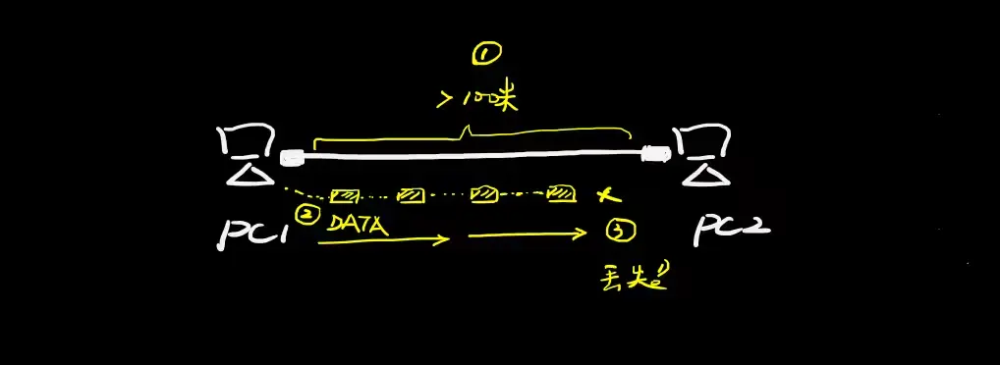

终端之间如果距离太远，一旦超过网线物理传输距离上限，则数据开始丢失。

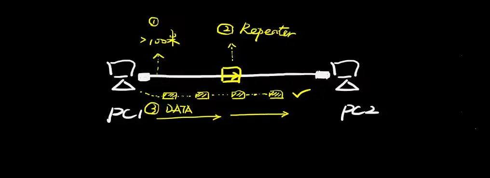

中继器（Repeater）是一种物理层产品，能够对信息进行**中继**和**放大**，实现设备远距离传输

### 3. 集线器

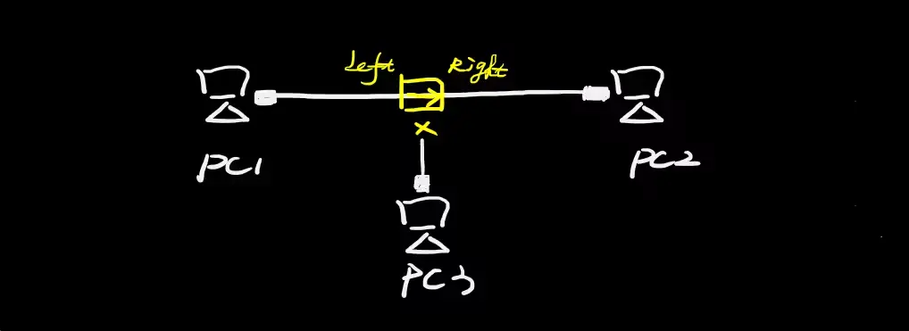

中继器一般只有两个接口，意味着如果网络中超过三个终端主机的话，则无法实现多主机直接的数据通信。

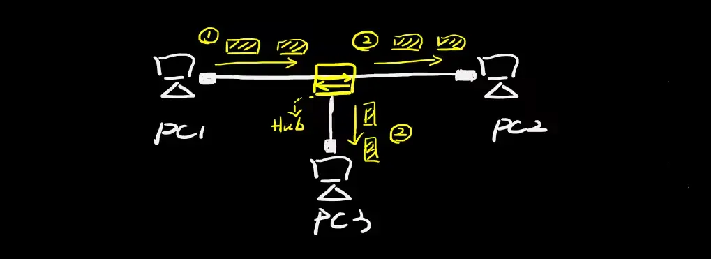

①集线器（Hub）是一种 “多口中继器”，也是属于物理层产品，能够对信息进行中继和放大，从任意接口收到的数据，会往其他所有接口泛洪。

②集线器不识别数据包的寻址信息和上层内容，无法对终端主机进行隔离，多个主机处于同一个冲突域中，采用集线器的
网络，带宽利用率较低。

### 4. 网桥

解决数据广播问题

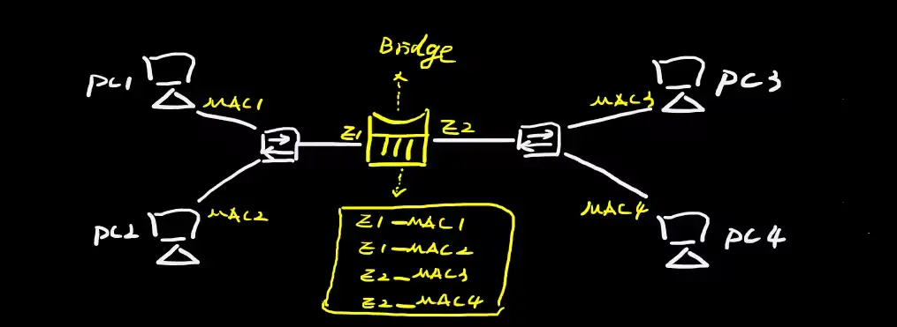

①网桥（Bridge）是一种链路层产品，能够记录终端主机的MAC地址并生成MAC表（也称为CAM表），MAC表相当于“地图”，网桥根据MAC表转发主机之间的数据流。

②网桥能够进行冲突域隔离，有效的提高网络带宽利用率，不同接口之间的数据不会相互冲突。例如PC1发给PC2的数据不会给转发到右边（E2口）。

③网桥的接口比较有限，默认是两个接口，对网络的冲突隔离比较有限，网桥没有专用的硬件而是采用CPU来处理数据，相对速度不够快。

### 5. 交换机

解决速度问题

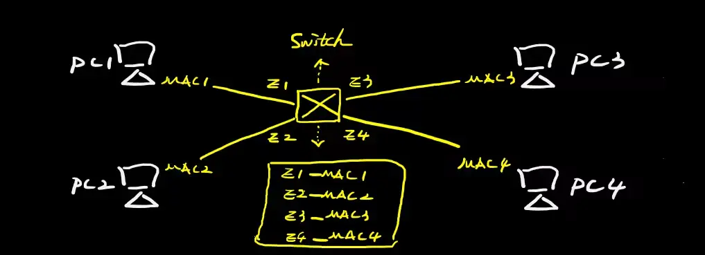

①交换机（Switch）是一种链路层产品，能够记录终端主机的MAC地址并生成MAC表（也称为CAM表），MAC表相当于“地图”，交换机根据MAC表转发主机之间的数据流。

②交换机是在网桥的基础上进行延伸和升级，相比网桥，主要有几个优势：
- 接口数量更加密集（每个主机在独立的冲突域，带宽利用率大大提高）
- 采用专用ASIC硬件芯片进行高速转发
- 能够进行VLAN隔离（不仅仅可以隔离冲突域，而且通过VLAN隔离广播域）

③交换机是一种局域网产品（历史上有很多局域网技术，目前是以太网技术称霸），一般用于本地网络，无法实现远程广域网通信。

### 6. 路由器

解决距离问题

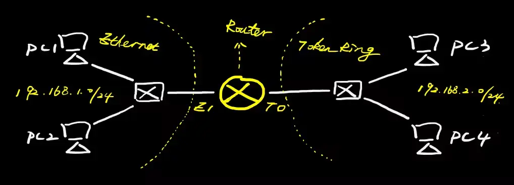

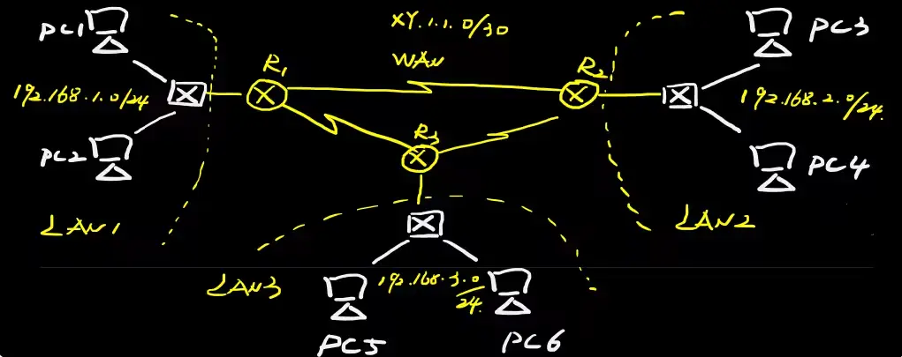

①路由器（Router）是一种网络层产品，基于IP寻址，采用路由表实现数据转发。

②路由器主要用于连接不同局域网（可以是不同介质，如令牌网和以太网可以互通），实现广播域隔离，也可以用于远程通信（广域网连接）。

③路由器诞生是互联网大爆发的主要原因，跨介质跨地理的网络大融合成为现实。

④IP协议等逻辑寻址机制是实现不同类型局域网连通的关键，不同局域网的主机只要有配置逻辑地址（IP地址），有合理的逻辑地址规划（网段规划），则可以通信；路由器在实现局域网之间通信时，会进行“介质翻转”和“路由转发”。

⑤全球第一台路由器由斯坦福大学的莱昂纳德·波萨克和桑蒂·勒纳这对教师夫妇创造的，用于斯坦福大学校园网络（SUNet），而全球网络行业的领头羊思科便是这对夫妇创立的（1984年）。

>注：巧合的是，20多年后（2006年），同样来自斯坦福的学生Martin Casado和教授Nick McKeown开创并奠定了Openflow/SDN基础，实现跨世纪的接力棒，为互联网技术注入未来！

### 7. 无线AC/AP

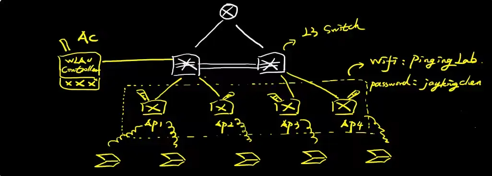

①无线AP（Access point）可以看成带有无线功能的交换机/路由器，随着无线城市、移动办公趋势，网络中无线产品的比例越来越多。

②根据部署方式的不同，可以分为胖AP和瘦AP解决方案。胖AP方案中，无线AP有独立的操作系统，可以独立调试无线热点的所有配置，类似家用的TP-LINK产品。瘦AP方案中，无线AP只具备无线信号发射的功能，所有命令调试全部集中在后台的AC/无线控制器上面。小型的无线网络（家用、小型企业）用胖AP即可解决，大型无线网络（无线城市、无线校园网）则需要用瘦AP方案）（AC+AP）来解决。

### 8. 防火墙

解决安全问题

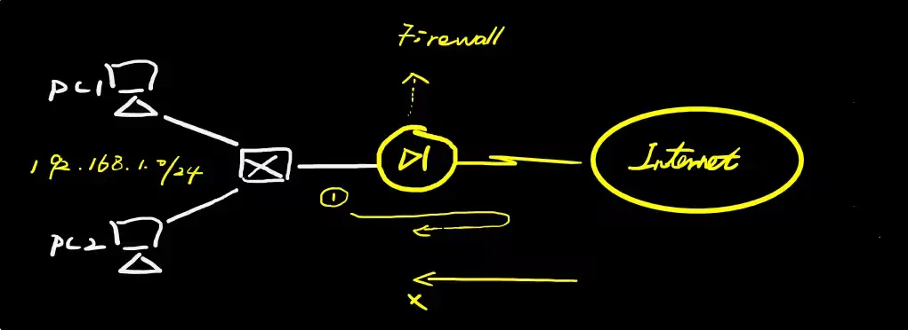

①防火墙（Firewall）是一种网络安全产品，用于对网络进行安全访问限制，一般用在互联网边缘，防止外部黑客攻击。

②根据防火墙的技术特征，可以分为包过滤、应用代理、状态检测防火墙；根据产品形态，可以分为软件和硬件防火墙。

③防火墙可以看成带有安全功能的路由器，早期的防火墙就是在路由器的基础上加入访问控制功能，所以防火墙的很多功能可以在路由器上看到，例如路由协议、访问控制列表、地址翻转技术等等。

④是否有了防火墙，就可以不用路由器了呢？网络边界的路由器是可以直接代替为防火墙，但是防火墙和路由器可以在网络里面同时存在，例如将防火墙放在路由器之前或者之后都可以，这样的话，路由器侧重地址翻转和路由策略，防火墙侧重安全隔离等功能。

⑤在防火墙的基础上，后面又延伸出了Web防火墙、安全网关、入侵检测/入侵防御等安全产品。

### 9. QOS(Quality of service)流量质量保证

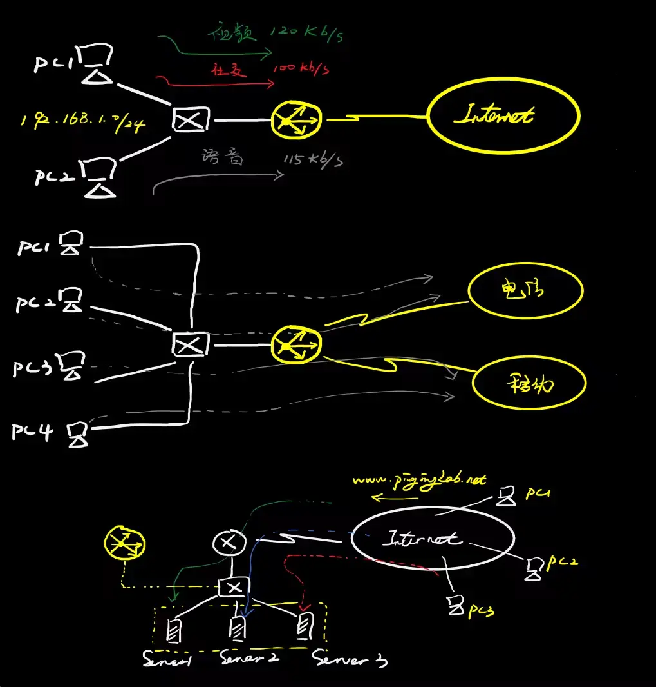

①网络中的流控（流量控制）产品主要分为上网行为管理、负载均衡器/应用交付、链路优化等。

②行为管理产品主要针对流量进行精细化区分控制；负载均衡/应用交付侧重流量的负载均衡（根据流量的特征、应用、地址等进行区分，然后分发到不同的链路和服务器上）；链路优化主要应用在广域网等低速链路边界，最大化利用链路。

③流控产品是一种七层产品，更多关注流量和应用特征。

## 常见的网络架构

### 1. 家庭Soho网络

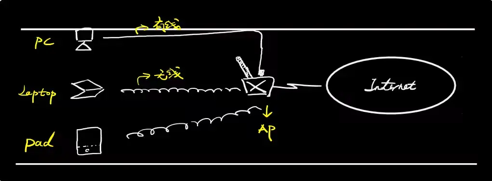

①说明：小型企业网络，采用两层架构，单核心拓扑

②设备：路由器、交换机、服务器

③技术：VLAN、TRUNK、DHCP、WLAN、静态路由/OSPF、PPPOE、NAT、ACL等

### 2. 小型创业公司网络

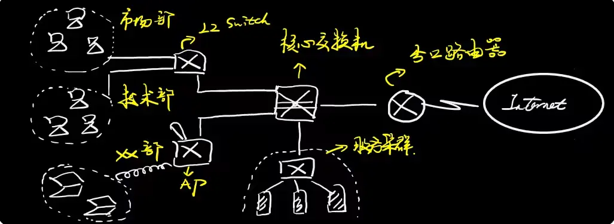

①说明：小型企业网络，采用两层架构，单核心拓扑

②设备：路由器、交换机、服务器

③技术：VLAN、TRUNK、DHCP、WLAN、静态路由/OSPF、PPPOE、NAT、ACL等

### 3. 园区网

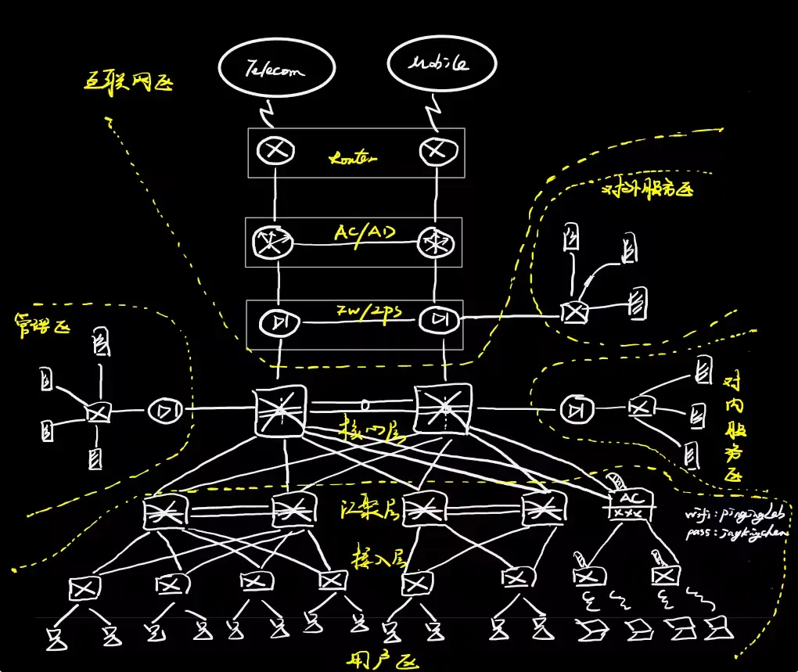

①说明：大中型企业网/校园网等最常见的园区网络架构，采用接入汇聚核心三层架构，双核心网络。根据网络需求，分为用户区、对内服务区、对外服务区、管理区、互联网区等，通过核心交换机和防火墙进行连接和隔离。互联网采用多出口连接，通过路由器进行拨号和NAT，通过流控产品进行负载均衡/上网行为管理，通过防火墙进行安全隔离。

②设备：路由器、交换机、无线AC/AP、防火墙、负载均衡器/行为管理、服务器

③技术：VLAN、TRUNK、MSTP、HSRP/VRRP、Etherchannel、WLAN、OSPF、NAT、ACL、PPPOE、Security SNMP等

### 4. 政务网

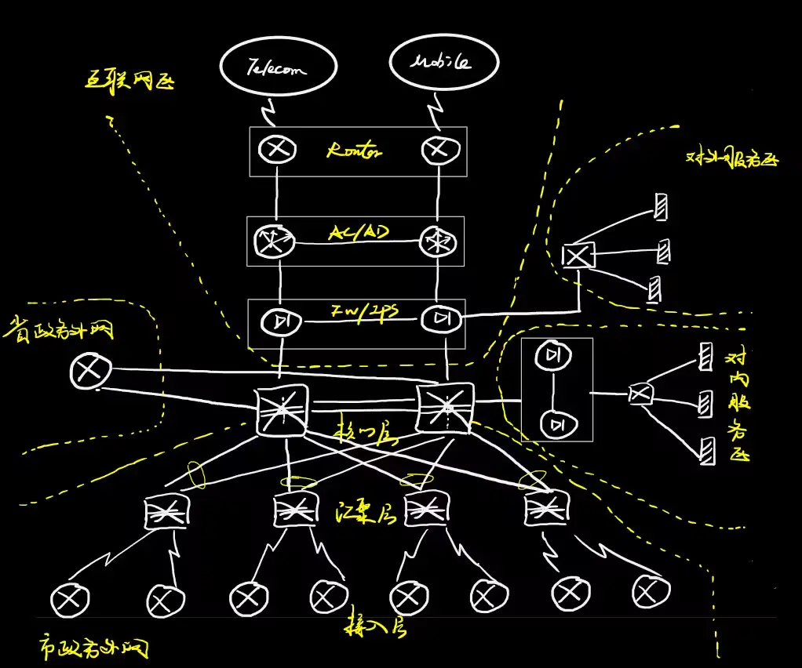

①说明：政府网包括政府、电力、公安等，都采用类似的城域网架构，全网通过MPLS技术来设计，将不同的地市接入CE通过汇聚PE进行连接，并划分到不同的VRF中，核心设备作为P/PE进行高速转发。不同地市之间通过VRF隔离访问，当需要访问互联网、政务外网、服务器等，通过RD/RT的设计来实现适度互访。

②设备：路由器、交换机、负载均衡器、防火墙、入侵防御、防DDOS、服务器

③技术：VLAN、TRUNK、OSPF、BGP、MPLS、QoS、ACL、NAT、SNMP、Security等

### 5. 数据中心

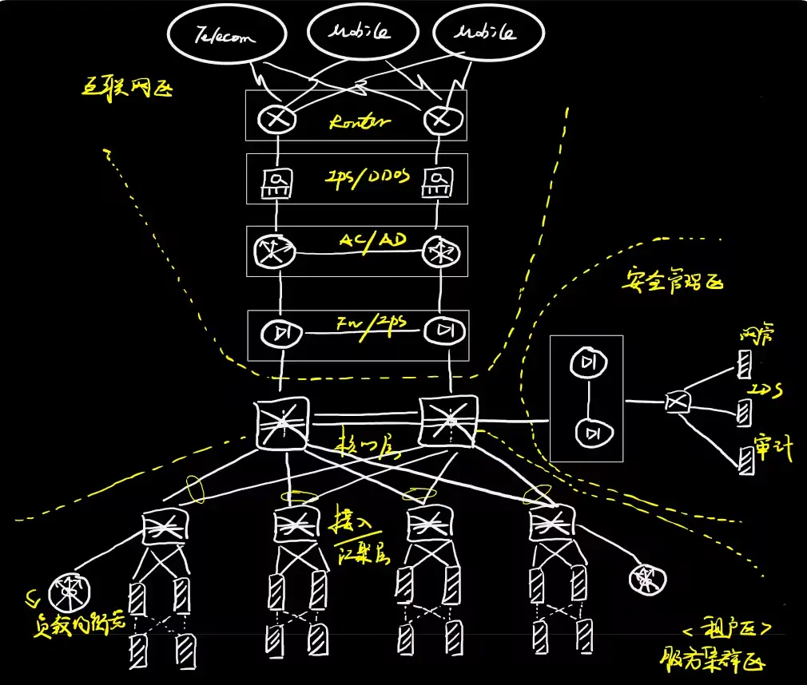

①说明：典型的大二层数据中心网络/IDC设计，主要分为租户区（服务集群）、互联网区、安全管理区。其中租户区采用设备虚拟化和链路虚拟化技术，将设备处理能力和链路承载能力提高，并且在服务器区域放置负载均衡器，将流量合理有效分配到固定的服务器上。互联网出口区采用路由器执行BGP和地址翻转，采用IPS/防DDOS设备放置大流量泛洪攻击，采用流控执行出口负载、采用防火墙进行安全隔离。安全管理区通过防火墙进行安全接入，通过审计、日志、入侵检测、网管等产品进行全网安全管理。

②设备：路由器、交换机、负载均衡器、防火墙、入侵检测/入侵防御、网络审计、防DDOS、服务器

③技术：VLAN、TRUNK、vPC、IRF、LISP、Vxlan、TRILL、FabriPath、OSPF、BGP、MPLS、Security、SNMP等
注：互联网公司（百度、阿里、腾讯）、IDC/云计算服务器商等常见网络架构。

### 6. 电信网/互联网

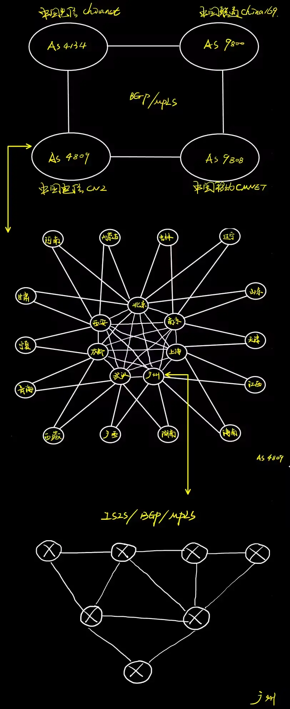

①说明：电信网/互联网主要采用城域网技术架构来实现，主要用于承载全国/全球的客户流量，是互联网中最核心承载网络。不同运营商之间采用多个AS自治系统隔离和相连，通过BGP协议交互路由，采用MPLS实现标签交换。

②设备：路由器、交换机

③技术：OSPF/ISIS、BGP、MPLS、Multicast、TE/QoS、Security、SNMP等

# TCP/IP协议栈

    内容：
    - 了解互联网是怎么通信的？
	- 掌握TCP/IP协议栈
    - 掌握模拟器与抓包软件等工具使用

## TCP/IP协议栈

### 概述
①1960年代，美国国防部组建的军事网络-阿帕网（APRANET ），而TCP/IP协议栈则是运行在阿帕网上的通信协议族；
②需要接入阿帕网联网的设备，都需要安装TCP/IP协议栈（可以看出一个软件或者驱动）；
③同时代的通信协议栈还有很多，例如IBM公司开发的SNA网络体系结构，DEC公司开发的DNA网络体系结构 ；不同公司和政府之间网络不同兼容；
④1983年，国际标准化委员会（ISO）发布了 OSI标准（开发系统互联模型），采用七层模型来统一不同的网络标准；
⑤随着网络的发展，以美国军方为代表的 TCP/IP通信机制凭借前期优势最终在市场上战胜其他企业标准；现在的电脑都是安装TCP/IP协议栈进行通信。

### OSI模型

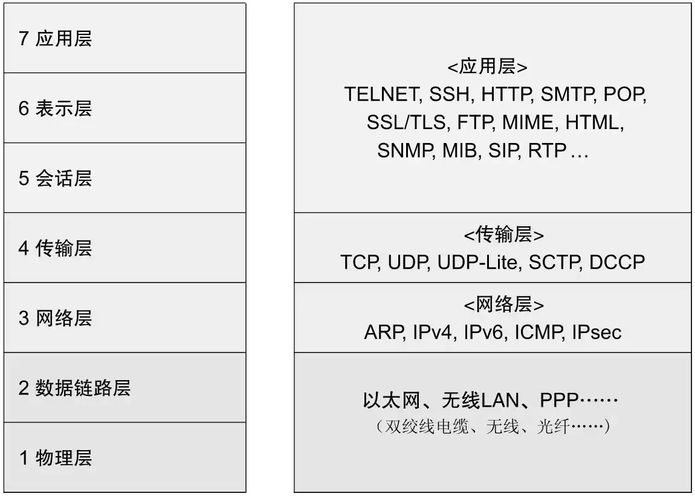

### 数据封装与解封装（发送接收过程）

①数据封装是一个为数据包加入寻址信息的过程（类似快递）

②端口号用于标志不同的应用程序，面向最终用户（80代表http/浏览器，8000代表oicq/qq）

③IP地址用于唯一标志通信设备，面向路由器

④MAC地址用于唯一标志局域网设备，面向交换机

### OSI数据封封装和解封装

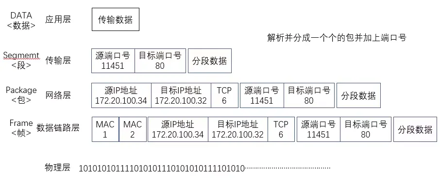

## Enthernet协议

1. 定义

Ethernet 以太网协议，用于实现链路层的数据传输和地址封装。
DIX联盟(Digital、Intel、Xerox)开发

2. 封装/原理

三个协议字段：  python scapy 
Destination/目的字段：标识目的通信方的MAC地址
Source/源字段：标识发送端的MAC地址
Type/类型值：标志上层协议

MAC地址（网卡）：
①所有设备的MAC地址都是全球唯一的，可以通过工具修改；
②MAC地址是16进制表示的，长度为48bit，采用冒号分16进制表示； 
01010100   10101010   10101111  11110000     2^48
③MAC地址前半部分被称为“OUI代码”厂商唯一标志符，
用于唯一标志一个企业/公司，例如思科、TP-LINK、华为；
后半部分厂商自行分配

## IP协议

1. 定义

Internet Protocol， 互联网协议，用于实现数据的不可靠面向无连接的通信，实现三层数据封装与IP寻址(IP协议包含了IP地址)

2. IP协议字段解读

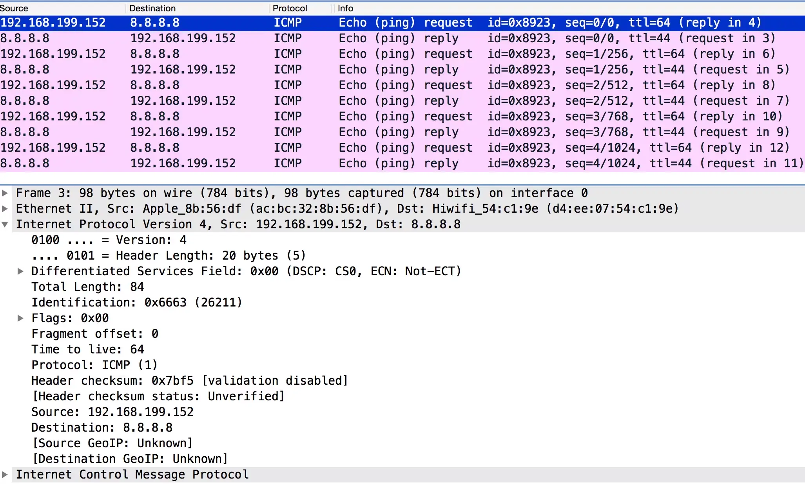

- Version（版本号）：标识IP协议的版本，目前V4版本地址已经枯竭，V6慢慢成为主流。
- Header Length（头部长度）：默认为20字节，最大为60字节。
- Differentiated Services Field （服务区分符）：用于为不同的IP数据包定义不同的服务质量，一般应用在QoS技术中。
- Total Length （总长度）：标识IP头部加上上层数据的数据包大小，IP包总长度最大为65535个字节。
- Identification （标识符）：用来实现IP分片的重组，标识分片属于哪个进程，不同进程通过不同ID区分。
- Flags（标志符）：用来确认是否还有IP分片或是否能执行分片。
- Fragment offset （分片偏移量）：用于标识IP分片的位置，实现IP分片的重组。
- Time to live （生存时间）：标识IP数据包还能生存多久，根据操作系统不同，TTL默认值不同，每经过一个三层设备如路由器的处理，则TTL减去1，当TTL=0时，则此数据包被丢弃。
- Protocol （协议号）：标识IP协议上层应用。当上层协议为ICMP时，协议号为1，TCP协议号为6，UDP的协议号为17。
- Header checksum （头部校验）：用于检验IP数据包是否完整或被修改，若校验失败则丢弃数据包。
- Source（源IP地址）：标识发送者IP地址，占用32bit。
- Destination （目的IP地址）：标识接收者IP地址，占用32bit。

(1)头部长度/总长度

IP状况标准是20字节，最大60字节
标明总长度是为了防止客户端拆包拆错位置

(2)DSCP/Qos字段

DSCP（Differentiated Services Field） 即服务区分符，用于为不同的IP数据包定义不同的服务质量。DSCP的前身叫做TOS（Type of Service，服务类型）。不管是TOS还是DSCP，它们都是QoS服务质量里面的技术实现。

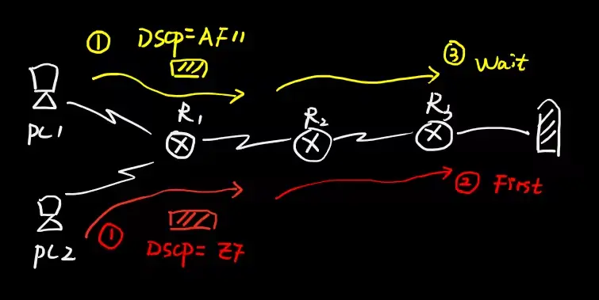

应用场景：在企业网中，网络运维人员可以为核心数据流采用高优先级的DSCP值，为其他普通的例如BT下载流量采用最普通的优先级。在运营商网络里，可以根据客户购买的不同专线服务，采用不同的DSCP值。

(3)TTL生存时间

占8个bit位，最大值255
IP数据包每经过一“跳”（ICMP包转发次数），TTL减去一
当路由器收到一个TTL=0时的数据包时，则宣告此数据包死亡并丢弃
TTL本质是为了IP数据包的“环路”问题。
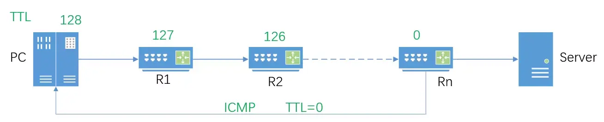
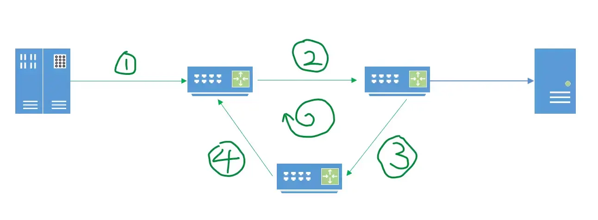

(4)协议号
类型值、协议号、端口号都是用于标志上层协议，方便接收方式实现数据的解封装。此功能称为协议之间的“分用”。
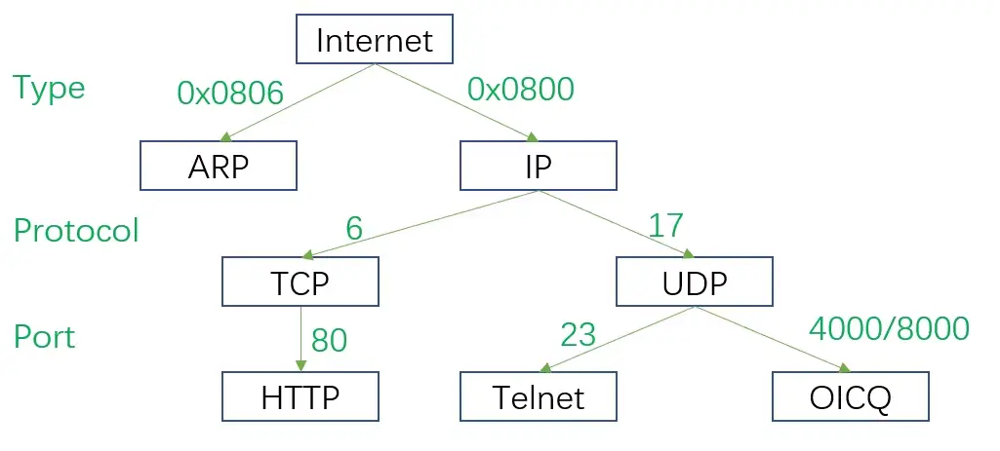

(5)头部校验和

通过校验和(奇偶校验)可以让接收方驻此数据包是否完整/篡改，若校验没问题则接收并处理，若检验有问题则丢弃。

(6)IP分片原理-标识ID、标志Flags、偏移量FO

MTU（最大传输单元）以太网数据包限制最大1500bytes

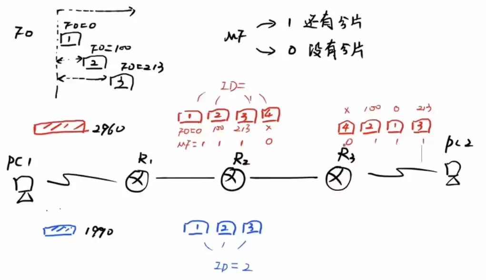

### IP地址

#### IP地址概述

|||
|----|----|
|作用|唯一标识一个网络设备（主机、路由器、服务器）|
|长度|32位 2^32≈43亿|
|范围|0.0.0.0 ~ 255.255.255.255|
|表示|点分十进制|
|组成|192.168.1.1 1.1.1.1 255.254.188.2 由网络部分和主机部分组成|
|二进制|00000000~11111111|
|十进制|0~255|

>不同局域网需要有不同的网络部分，通过网络部分区别出网段/网络；局域网内部，主机部分不能一样，否则会出现地址冲突

  - ①基于技术分类

||||
|----|----|----|
|A类|1.0.0.0 ~ 126.255.255.255|前8位为网络位、后24位为主机位|
|B类|128.0.0.0 ~ 191.255.255.255|前16位为网络位、后16位为主机位|
|C类|192.0.0.0 ~ 233.255.255.255|前24位为网络位、后8位为主机位|
|D类|224.0.0.0 ~ 239.255.255.255||
|E类|240.0.0.0 ~ 255.255.255.254||

> A/B/C三类地址为商用地址，D类组播地址、E类为科研地址
>
> 目前国际上由IANA来管理IP地址，中国的IP地址由CNNIC来管理

  - ②基于应用分类

|私有地址(网络中NAT动态分配到的地址)|
|----|
|10.0.0.0    ~  10.255.255.255|
|172.16.0.0  ~  172.31.255.255|
|192.168.0.0 ~  192.168.255.255|

公有地址：除去私有地址和特殊地址

|特殊地址|
|----|
|环回测试loopback地址：127.x.x.x 一般用来表示本地主机|
|全网地址：0.0.0.0（默认地址）|
|广播地址：255.255.255.255 代表整个局域网|
|自动配置地址：169.254.x.x 一般通过DHCP没法获取到IP地址时，系统自动给网上分配的地址|

  - ③IP地址术语

|||
|----|----|
|网段/子网(subnet)|表示一个局域网，例如192.168.1.X => 192.168.1.0 ~ 192.168.1.255|
|有效IP地址数|一个网络/网段去掉“头”和“尾”|
|网络地址|网段的形状，用来代表一个网段|
|广播地址|用来代表整个网段所有主机|
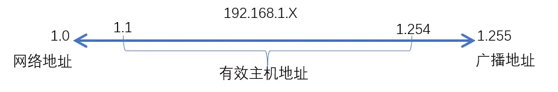

#### IP子网分类

1. 子网掩码

定义：subnet mask，用于区分IP地址的网络部分和主机部分
> 192.168.1.1 11111111:11111111:11111111:00000000 => 255.255.255.0
 
原理：1表示网络位，0表示主机位

表示方法：点分十进制/前缀表示法

>点分十进制：255.255.255.0
>前缀表示法：/24

2. 子网划分

VLSM(varible length subnet mask,可变长子网划分)

原理：通过借用主机位来实现网络切割;通过子网划分更有效的利用IP地址
>192.168.1.0 /24 C类地址 2^8个主机地址256
>192.168.1.0 /24 一个网络/网段 => 子网划分 => 多个子网（企业/学校）

3. 企业案例

#### IP路由汇总

>如何将4个子网192.168.1.0、192.168.1.64、192.168.1.128、192.168.1.192汇总成一个大网？
>
>原理：从左到右找相同的比特位
>
>①换算成二进制
>|||
>|----|----|
>|192.168.1.0   |=>192.168.1. 00  000000|
>|192.168.1.64  |=>192.168.1. 01  000000|
>|192.168.1.128 |=>192.168.1. 10  000000|
>|192.168.1.192 |=>192.168.1. 11  000000|
>②从左到右找相同的比特位，然后网络位不变，主机位归0
>
>24 => 最终汇总后的子网掩码
>
>192.168.1.0 /24

## ARP协议

1. 概述

①ARP（Address Resolution Protocol）即地址解析协议， 用于实现从 IP 地址到 MAC 地址的映射，即询问目标IP对应的MAC地址。
②在网络通信中，主机和主机通信的数据包需要依据OSI模型从上到下进行数据封装，当数据
封装完整后，再向外发出。所以在局域网的通信中，不仅需要源目IP地址的封装，也需要源目
MAC的封装。
③一般情况下，上层应用程序更多关心IP地址而不关心MAC地址，所以需要通过ARP协议来获知目的主机的MAC地址，完成数据封装。

2. 原理

同一个局域网里面，当PC1需要跟PC2进行通信时，根据OSI数据封装顺序，发送方会自顶向下（从应用层到物理层）封装数据，然后发送出去
这里以PC1 ping PC2的过程举例==>
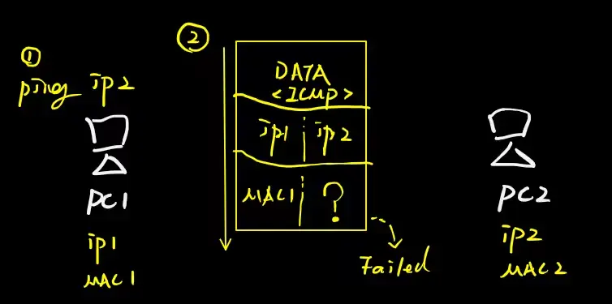

PC1封装数据并且对外发送数据时，上图中出现了"failed"，即数据封装失败了，
我们给PC1指令-"ping ip2"，这就告知了目的IP，此时PC1便有了通信需要的源目IP地址，但是PC1仍然没有通信需要的目的MAC地址。

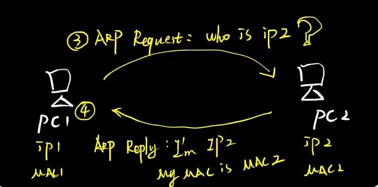
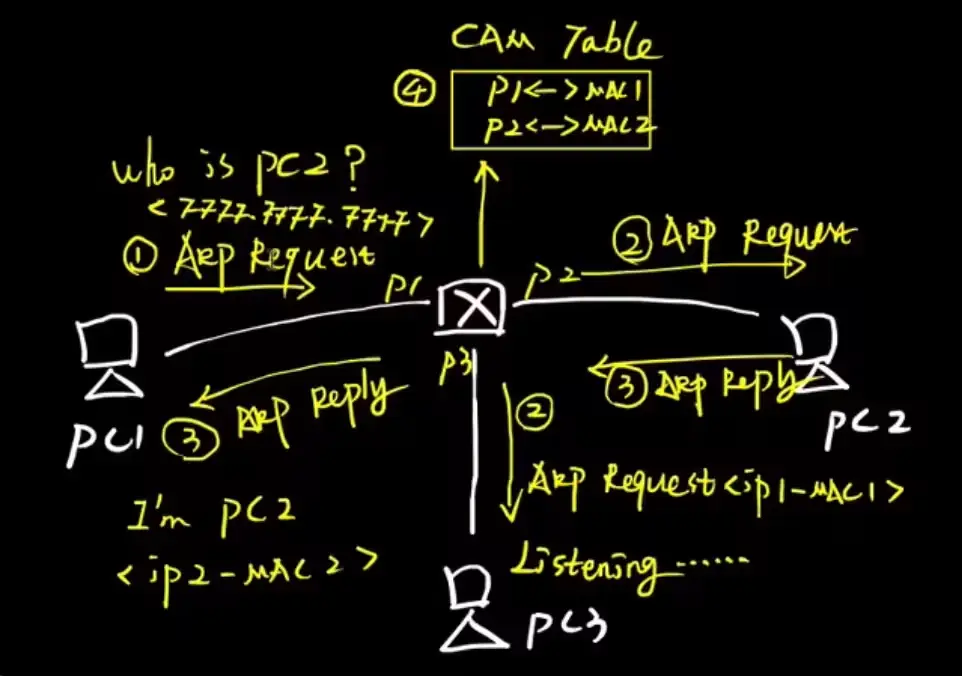

此时pc1会进行广播来查询pc2的mac地址，发送的包中mac填的是0，在pc2收到广播后，会向pc1进行单播来发送自己的mac地址，pc1会将pc2的mac信息放入本地的『ARP缓存表』，接下来pc1再次进行数据封装，正式进入PING通信 
通过命令行"arp -a"查看『ARP缓存表』，"arp -d"来删除缓存表

## ICMP协议

1. 概述

互联网信息控制协议，Internet Control Message Protocol
用于实现链路连通性测试和链路追踪，可以实现链路差错报告。
ICMP运行在传输层协议，服务于IP协议。

2. PING

探测目的主机是否有问题，探测本地到目的的延迟等
Echo request 回显请求
Echo reply 回显应答

3. Tracert/Traceroute：探测本地到目的路径，拓扑踩点

- windows tracert原理
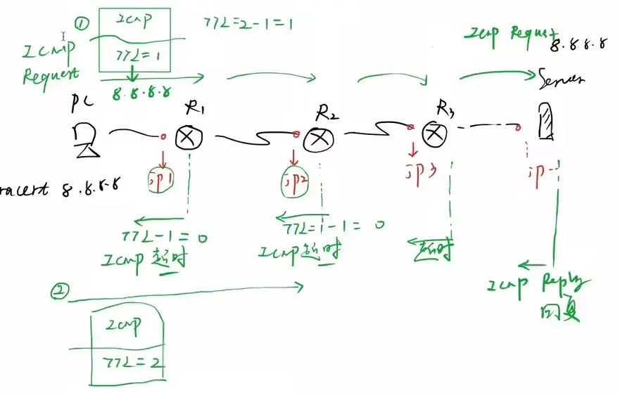

- liunx/unix traceroute原理

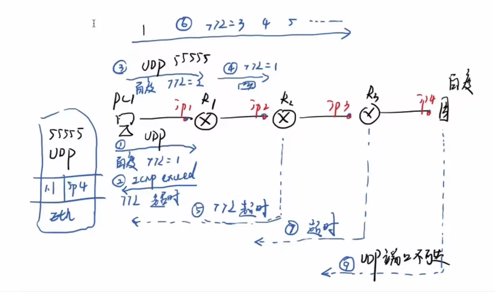

## UDP协议

1. 定义

用户数据协议，user datagram protocol, 用于实现面向无连接的不可靠协议，传输协议

2. 特征

➀数据包结构非常简洁
②处理速度快
③实时交互(社交软件、视频流、实时交互协议)

3. 基于UDP的协议

|协议|端口|
|---|---|
|DHCP|67/68|
|DNS||
|OICQ||
|TFTP||

拓展：
1、通信过程中，源端口(1-65535)一般属于随机高端口，目的端口属于固定知名端口
2、1-1023为知名端口号范围，已经被占用
3、DHCP的源目端口都固定，客户端端口为68、服务端为67。
4、DNS域名解析协议基于UDP端口号53；通过DNS请求和回复过程，获取域名对应IP

## DHCP协议

1. 定义
动态主机配置协议，Dynamic Host Configuration Protocol，用于初到地终端设备的动态IP信息分配（IP地址、网关地址、DNS服务器、WINS服务…）

旧名字 bootparams
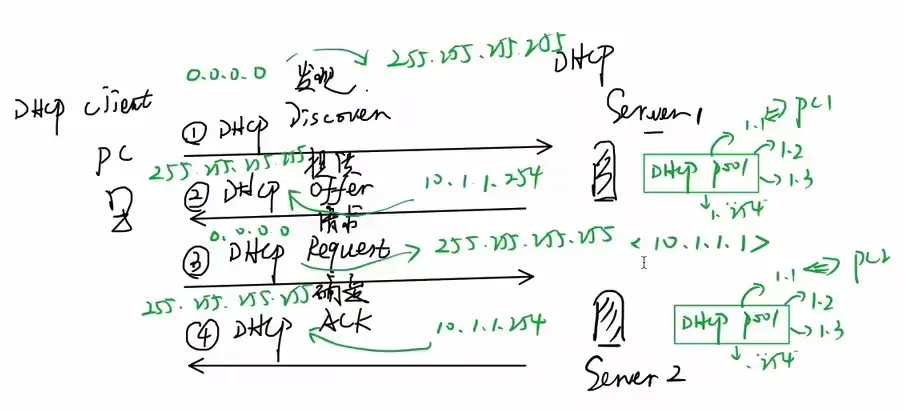

unix/liunx
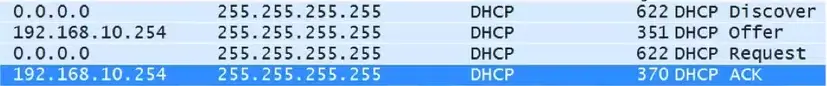

windows
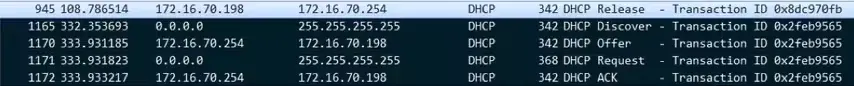

- 数据包的功能？

  **发现包**用于广播发现局域网DHCP服务器；

  **提供包**用于预回复客户端，告知其即将给的IP地址；

  **请求包**正式对感兴趣的服务器IP地址发起请求；

  **确认包**对客户端进行最终的正式确认（这个时候服务器会将此分配出去的IP地址建立mac表）
- 为什么需要4个包来获取地址，而不是2个包？

2个包无法解决多服务顺环境下，地址济浪费/冲突问题
- DHCP请求初期客户端没有IP地址，那么如何对外发送发现和请求呢？0.0.0.0
- DHCP的交互过程都是广播包形式来实现的，目的IP采用255.255.255.255
- DHCP交互过程，服务端67，客户端68

## TCP协议

1. 概述

Transmission Control Protocol
面向连接（三次握手、四次挥手；SYN/ACK/FIN位）
可靠传输（经典重传、超时重传、快速重传/选择性重传）
流量控制（滑动窗口、拥塞管理）
多路复用（套接字socket、会话session、五元组）

基于TCP的协议：
|协议|端口|
|---|---|
|FTP|20/21|
|SSH|22|
|Telnet|23|
|HTTP|80|
|HTTPs|443|
|SMTP/POP|25/110|

2. 原理

①面向连接
（三次握手与四次挥手）
三次握手：
四次挥手：

②可靠传输
（序列号SEQ、确认号ACK）

## Telnet

1. 定义 

远程登录协议，用于对设备进行远程管理，基于明文目前不建议使用，建议采用SSH协议
目前不建设使用，建议采用SSH远程登录

2. 可靠传输

正常不丢包情况下，ACK(n+1) = SEQ(n) + Len(n)，即下一次的确认号等于上一次的序列号加数据包长度值；若丢包情况下，则ACK(n+1) < SEQ(n) + Len(n)
 
下一次的序列号等于上一次的确认号Seq(n+1) = ACK(n)

3. 流量控制

通过windows size value字段，表示本地能承受的最大的包的大小

4. 多路复用

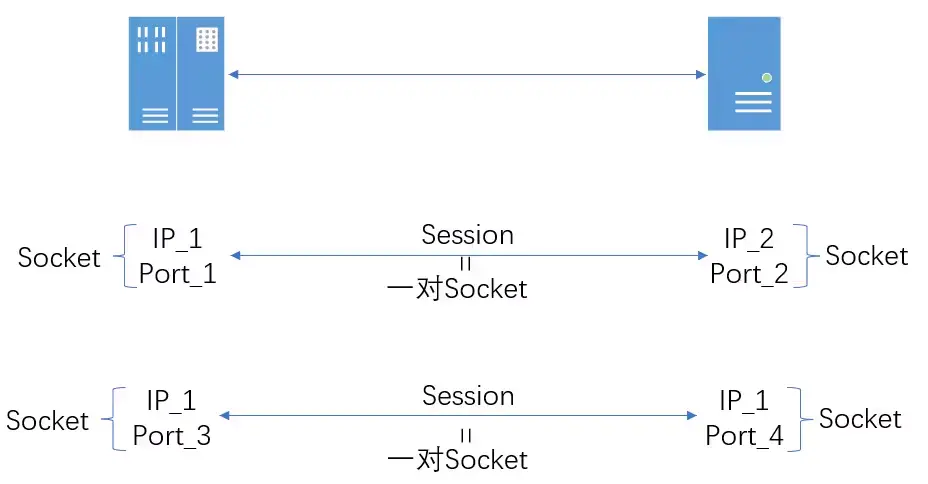

TCP通过端口号(port) 或 套节字(ip + port)实现多路复用

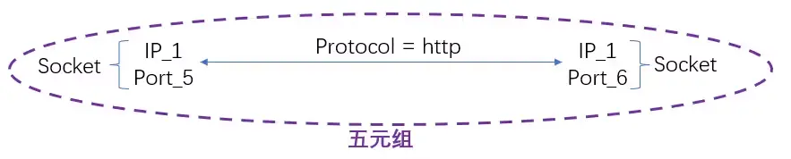

源目IP + 源目Port + 协议号 = 五元组

## 互联网攻防技术

### ARP攻击原理

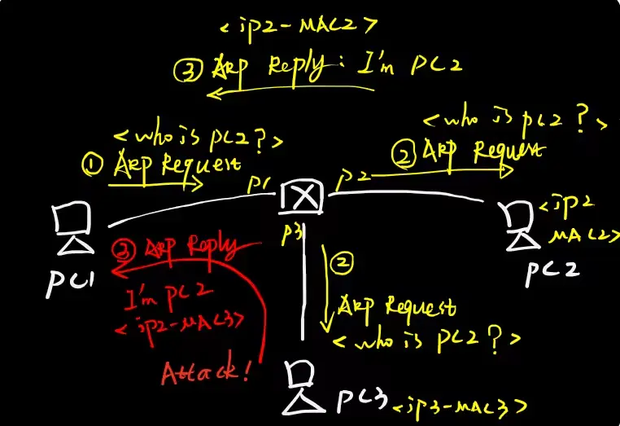
正常情况下，若收到的ARP请求不是给自己的，则直接丢弃；而这里PC3（Hacker）在监听之后，发起了ARP回应包：我就是PC2（IP2-MAC3）。从拓扑可以出现，PC3明明是IP3对应MAC3，很显然这就是一个ARP欺骗行为。
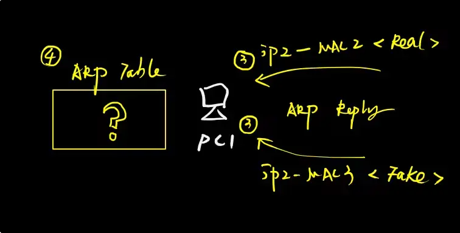

ARP和CAM表，就是遵循"后到优先"原则,稳健的ARP嗅探/渗透工具，能在短时间内高并发做网络扫描（例如1秒钟成千上百的数据包），能够持续对外发送欺骗包。
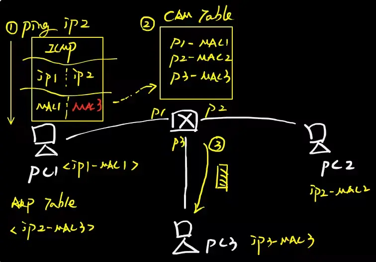

根据数据封装规则，当PC1要跟PC2进行通信时，无论是发生PING包还是发送其他数据，
首先要查找ARP表，然后在网络层打上源目IP，在链路层打上源目MAC，然后将数据包发送给交换机。交换机收到之后对数据进行解封装，并且查看CAM表（基于目的MAC转发），由于目标MAC3对应Port3，所以交换机自然而然将其转发给PC3。

就这样，PC1本来要发给PC2的数据包，落到了PC3（Hacker）手里，这就完成了一次完整的ARP攻击。反过来，如果PC2要将数据包发送给PC1，PC3仍然可以以同样的ARP欺骗实现攻击，这就有了下面这张图（PC3既欺骗了PC1，也欺骗了PC2）。

### ARP 防御原理

通过动态ARP监测技术（DAI），可以很好的解决ARP欺骗问题。
①交换机记录每个接口对应的IP地址和MAC，即port<->mac<->ip，生成DAI检测表；
②交换机检测每个接口发送过来的ARP回应包，根据DAI表判断是否违规，若违规则丢弃此数据包并对接口进行惩罚。

# 交换机相关技术

## 交换机结构

（1）ROM(read-only memory)

功能：启动系统、密码恢复、系统升级或恢复

组成：

①POST程序：用于实现加电自检(power-on self-test)

②Bootstrap程序：引导程序，用于引导加载操作系统

③Rommon程序：用于做密码恢复及系统升级

（2）NVRAM

功能：放置配置文件+配置寄存器(configuration register)

配置寄存器的功能 ：用于影响路由器的启动流程（密码恢复）

0x2102：正常加载操作系统并加载配置文件
0x2142：正常加载操作系统但不加载配置文件

- 交换机硬件架构

1. 计算系统
2. 电源系统
3. 存储系统
   1. flash硬盘 ->存储IOS + 配置config
   2. RAM 内存
   3. ROM 只读存储器 <cmos/bios>
4. 接口系统

- 设备启动流程

（1）路由器

1. 加电自检(POST)
2. 从ROM中加载并运行bootstrap启动微代码
3. 查看NVRAM中的配置寄存值
4. 寻找IOS映象文件(FLASH)
5. 加载IOS映象文件(RAM)
6. 寻找配置文件(NVRAM)
7. 加载配置文件(RAM)
8. 正常运行

（2）交换机

1. 加电自检(POST)
2. 加载并运行bootstrap
3. 寻找IOS映象文件
4. 加载IOS映象文件
5. 寻找配置文件
6. 加载配置文件
7. 正常运行

## 设备基础互联

1. 设备连接方式

①近端管理（带外管理）

②远程管理（带内管理）

2. 网线

分类：

根据是否屏蔽：屏蔽双绞线和非屏蔽双绞线UTP

根据类型：直通线（A-A B-B）和交叉线（A-B）

线序：

568B: 橙白 橙 绿白 蓝 蓝白 绿 棕白 棕

568A: 绿白 绿 橙白 蓝 蓝白 橙 橙白 棕

连线规则：

同级/层设备交叉线，不同级/层设备直通线（目前的大部分设备支持自动翻转，所以都用直通线也能通信）

## GNS3操作

- 接口类型
  - f:fast ethernet 快速以太网
  - e:ethernet 以太网
  - s:serial 广域网
- 模块类型
  - NM - network moddle 网络模块
  - 1FE - 1 Fast Enthernet 一个快速以太网口
  - TX - 网线(双绞线)
  - 4T - 4个广域网口
  - NM-1FE 1个快速以太网模块
  - NM-1E 1个以太网模块
  - NM-4E 4个以太网模块
  - NM-16ESW 16个交换快速以太网，用于模拟交换机
  - NM-4T 4个广域网口

- 接口序号

前面数值为模块序号
后面数值为接口序号
1/2表示第1个模块的第2个接口

GNS3: 设置语言（中文） - 导入IOS镜像 - 搭建网络拓扑 - 设置 SecureCRT - 关联Wireshark
SecureCRT：修改字体大小 - 修改配色方案 - 修改透明度

命令模式：
- &gt;      用户模式：类似普通用户，对系统基本的查看功能
- &#35;     特权模式：类似管理员，对系统进行基本的管理
- (config)# 配置模式：类似超级管理员，对系统执行所有操作

“看/测东西在特权，配东西在配置”

常用指令
~~~
enable:“使能”，从用户模式切换到特权模式
configure terminal:“配置终端”，从特权模式切换到配置模式
exit:“退出”，从配置退回特权；从特权退回用户
~~~

进入GNS的“用户模式”
~~~
configure terminal
line console 0
no privilege level 15
exit
~~~

常用的快捷键
- tab 补全命令
- Ctrl + A 光标前移
- Ctrl + E 光标后移
- Ctrl + Z 退出，功能类似end命令
- Ctrl + Shift + 6 中断命令执行（功能类似Windows dos里面的ctrl + c）
- ? 用于查看在此环境下能够用到的命令
- Space 用于滚动翻看
- Enter 逐行查看
- ↑↓ 历史查询
- Alt + x 

### IOS常用命令

（1）用户模式
- Ping 测试连通性
- traceroute 链路追踪
- Show arp 查看ARP表项
- Show clock 查看系统时间
- Show version 查看系统版本信息，软件和硬件信息

（2）特权模式
- show flash 查看硬盘大小
- show running-config查看运行配置（内存）
- show startup-config查看初始配置（NVRAM）
- copy run start 保存配置
- write 保存配置
- show ip interface brief 查看接口三层地址信息ipconfig

down down / up down / up up

- show interface f0/0 查看接口具体信息（包括二层信息）

（3）配置接口
- hostname R1 定义主机名
- interface f0/0 进入接口模式
- no shutdown 打开接口
- ip address 12.1.1.1 255.255.255.0 定义IP接口

- no ip domain-lookup 关闭域名解析
（默认情况下路由器会对命令进行域名查找，此时会占用很多时间，设备会“卡壳”，通过此命令，关闭此域名查找功能）

- line console 0 进入console口模式
- exec-timeout 0 0 关闭发呆超时
- logging synchronous日志输出同步

### 配置Telnet服务器
~~~
line vty 0
password pinginglab
login
~~~
Telnet 客户端登录 
~~~
telnet 12.1.1.2
~~~

### ISO进阶操作

1. 管理密码

(1) 密码配置

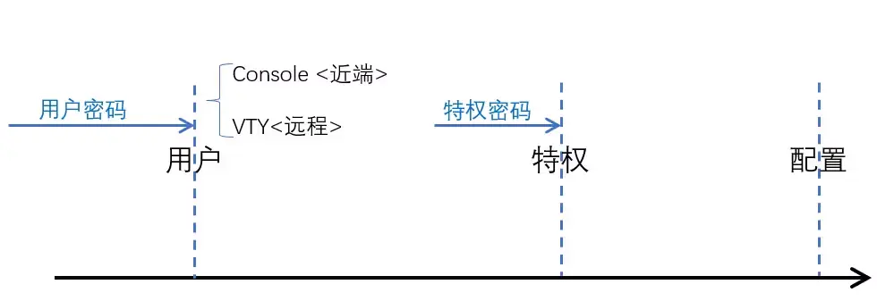

用户密码
一般不用①②，明文不安全，用第三种

①
~~~
line console 0 //进入console口
no privilege level 15 //关闭权限
exec-timeout 0 0 //设置不会超时关闭
password 12345 //定义密码
login //登录时调用

line vty 0 15 //进入虚拟终端口到15口
password 12345 //定义密码
login //登录时调用
~~~
②
~~~
username timothy password 123456 //定义本地用户名数据库
username alice password 654321 //明文
line console 0
login local //调用数据库
line vty 0 15
login local
~~~

③
~~~
username 123 secret 456 //密文（MD5哈希值）
username 456 secret 789
line console 0
login local
line vty 0 15
login local
~~~

特权模式

~~~
enable secret 456789
service password-encryption //全局加密服务
~~~

0 不加密 7 奇偶加密 5 MD5加密
优化点：账户隔离|加密存储

#### 路由器密码重置

1. 正常模式下重启(reload)，并按住ctrl+break进入ROMMON模式

【将波率改为1200，按住空格键，然后再改回来9600】
2. ROMMO模式下修改寄存值为0x2142

rommon 2> confreg 0x2142
3. ROMMON模式下重启

rommon 2 > reset
4. 正常模式下将配置文件加载至内存，并进行密码管理

Copy start run //将配置文件/命令导入内存
No username 123
Line con 0
No login
No login local
write

5. 配置模式下修改寄存值为0x2102

Config-register 0x2102
6. 正常模式下重启

reload
7. 密码恢复成功

#### 管理配置

1. 保存
~~~
copy rin start
write
~~~

2. 恢复

~~~
copy start run(router)
copy flash:config.text run (switch)

copy tftp: run
copy tftp: start

debug ip icmp //开启ICMP动态调试
undebug all //关闭所有调试
~~~

3. 删除

~~~
no + 命令（一条一条删除）

write erase（删除整份配置文件）
reload
~~~

4. 备份

PC <-----> Router/Switch

TFTP Server <--> TFTP Client 

①通过网线连接电脑和路由器或者交换机为电脑和设备配置IP地址

路由器：
~~~
int g0/0
no shutdown
ip address 192.168.1.1 255.255.255.0
~~~
交换机/路由器
~~~
int vlan 1 //虚拟管理口
~~~

# 路由技术

研究路由器寻找最佳路径的过程(路由协议)

路由器根据最佳路径转发数据包

静态路由：RIP、RIGRP、OSPF、ISIS、BGP

## 静态路由技术

### 静态路由

路由技术分类：静态路由技术(由人工分配线路) vs 动态路由技术(无人工干预)

静态路由(Static Route)是第一代路由技术，由网络管理员手工/静态编写路由/路径，
告知路由器将数据包转发到那个接口/下一跳（邻居），比较适合小型网络

项目实例

语法
~~~
ip route 目标网段 + 目标掩码 + 出接口/下一跳(next-hop)

常用show命令
show ip interface brief       //查看接口IP地址
show run interface f0/0       //查看接口配置
show run | include ip route   //查看静态路由的配置
show ip route                 //查看路由表
show ip orute static          //查看静态路由
~~~

实验流程

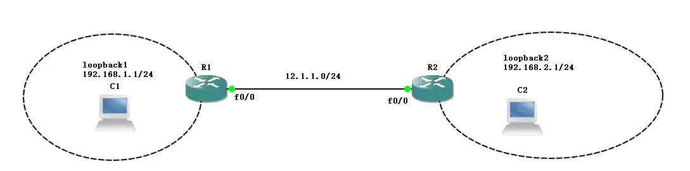
~~~
1. 为路由器配置IP地址(物理接口和接口)

为路由器配置IP地址
configure terminal
interface f0/0
no shutdown
ip address 12.1.1.1 255.255.255.0

增加环回地址(loopback)
interface loopback 1
ip address 192.168.1.1 255.255.255.0

2. 查看路由表 
show run interface f0/0       //查看接口配置
show run | include ip route   //查看静态路由的配置
show ip route                 //查看路由表
show ip orute static          //查看静态路由

3. 配置静态路由，实现路由器背后主机联通
ip route 目标网段 + 目标掩码 + 出接口/下一跳
ip route 192.168.2.0 255.255.255.0 f0/0
ip route 192.168.2.0 255.255.255.0 12.1.1.2
ip route 192.168.1.0 255.255.255.0 f0/0

4. 测试连通性
R1: ping 192.168.2.1 source 192.168.1.1
R2: ping 192.168.1.1 source 192.168.2.1

~~~

#### 默认路由

1. 原理

①Default Route，默认路由，一般应用于网络（企业网、校园网、园区网等）出口，用于指向互联网，实现有够与外网通信。

②默认路由一般放在路由表的最底部，只有当常规/精准路由条目没有匹配时，才会查看/调用默认路由，所以我们也将默认路由称为“最后一根稻草”。

③在主机/电脑上，默认网关就相当于默认路由，电脑上通过route print 查看路由表
Default-getway default-route

2. 部署方法

默认路由语法
~~~
ip route 0.0.0.0 0.0.0.0 出接口/下一跳IP地址
~~~

>默认路由不通相互指定，否则会造成“环路”

#### 浮动路由

1. 原理

Floating Route，浮云路由，用于实现多出口环境下的路径选择，通过浮云路由技术，可以将所有数据流指往主路径，当主路径出现故障后，能够自动切换到备用路由

2. 设置方式

优先级/管理距离：0-255 越小越优先，不写默认是0，优先级最高
~~~
ip route 0.0.0.0 0.0.0.0 f0/0 0

debug ip icmp    //调试icmp协议
debug ip packet  //调试ip协议
undebug all      //关闭所有调试
~~~

代理ARP（写出接口与IP的区别）

定义：Proxy-arp,当出现跨网段的ARP请求时，路由器将本地MAC返回给ARP询问者实现MAC地址代理，最终使得主机能够通信

(1)当路由器/主机的路由条目指向*出接口*时，则触发了代理ARP

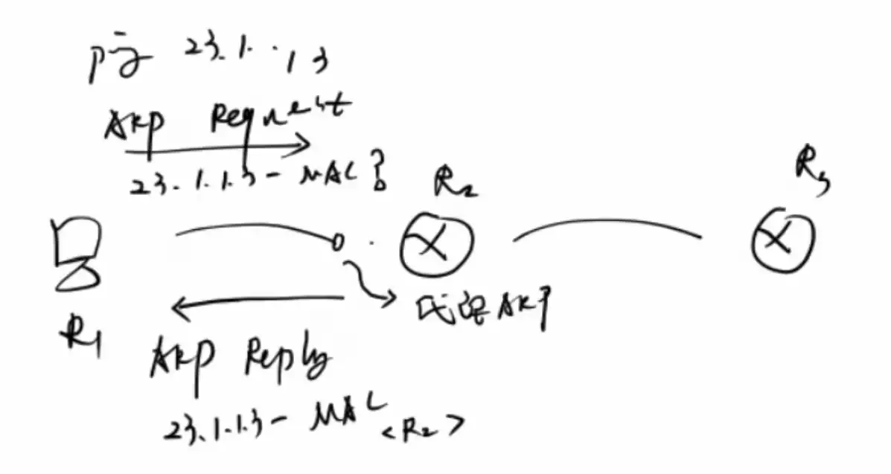

(2)当路由器/主机的路由条目指向*下一跳IP地址*时，则采用正常/常规ARP

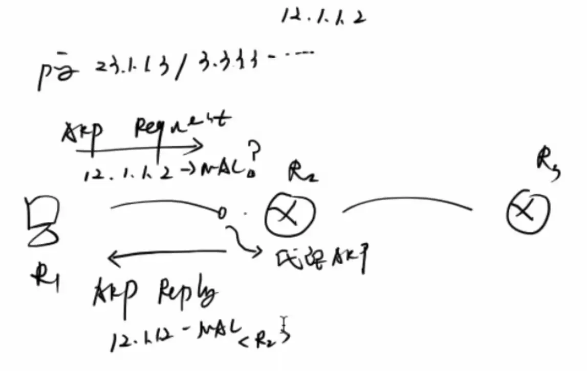

#### 动态路由

1. 动态路由协议VS静态路由协议

①管理层面：静态路由比较容易部署/修改（小网络），动态路由协议一般路由的体
积比较大，管理相对比较复杂（大网络）。

②技术层面：动态路由协议能够适应各种网络结构的拓扑，能够智能检测网络状态；
静态路由技术无法实现，需要人工干预

2. 支柱路由协议分类

RIP/EIGRP/OSPF/ISIS/BGP   SDN/Openflow

①算法特征：
距离矢量：RIP、EIGRP、BGP
链路状态：OSPF、ISIS

②运行范围
IGP：internal gateway protocol内部网关协议RIP/EGRP/OSPF/ISIS
EGP：external gateway protocol外部网关协议BGP

③有类/无类
类别：A/B/Cclass
有类classful：IP子网只能识别/8/16/24，自动汇总
无类classless：IP子网只能识别任意拖码

有类classful：RIPv1、IGRP
无类classless：RIPV2、EIGRP、OSPF、ISIS、BGP

3. 通用路由选择算法<最长匹配原则、管理距离/优先级、度量值、负载均衡

①最长匹配原则
当路由器访问目的地并且有多路径时，将目的P地址跟本地路由条目进行对
比，从左到右匹配的比特位越多，则越精准，优先级越高

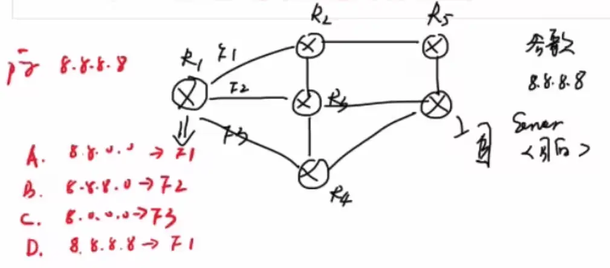

②管理距离
定义：Adminstrator Distance，也称为优先级，越小越优先，管理距离可以用于衡量不同路由协议直接的路径优劣。
常见的AD值：

|connect|0|
|---|---|
|Static|0|
|RIP|120|
|EIGRP|90或170|
|OSPF|110|
|ISIS|115|
|BGP|20或200|

③度量值
定义：Metric，用于衡量同一路由协议的路径优。度量便是路由协议用于计算路径的方式/参数，例如带宽、长短、MTU、延退等等。

|RIP|跳数（路由器的个数）|
|---|---|
|RIGRP|混合度量值（带宽、延迟、负载、可信度、MTU）|
|OSPF|开销（带宽）|
|ISIS|固定值|
|BGP|选路原则|

>例==>最长匹配原则->管理距离->度量值->负载均衡
>
>PING 8.8.8.8
>
>S 1/0 8.0.0.0/8
>
>S 1/0 8.0.0.0/8
>
>R 120/5 8.8.0.0/16
>
>B 20/0 8.8.0.0/16
>
>O 110/1 8.8.8.0/24
>
>O 110/2 8.8.8.0/24
>
>I115/2 8.8.8.0/24
>
>优选O 110/1 8.8.8.8/24 若还存在一个O 110/1 8.8.8.8/24 F2，则会向多个地址发包

## 动态路由协议

### RIP

1. 背景

Routing information Protocol, 路由信息协议，是第一代动态路由协议；所属距离适量协议，*基于跳数来进行路径选择(最多支持15跳)*。RIP协议有多个版本，分为v1/v2/ng版。

2. 特征

- OSI层次：应用协议，基于UDP端口520
- 算法特征：距离矢量协议
- 有类无类：v1为有类、v2为无类
- 去年范围：IGP
- 最佳路径：管理距离120、度量值：跳数（路由器的个数）

3. 路由分组

定义：RIP回复分组，用于更新/发送本地路由信息

特征：周期更新（25.5~30s）、广播更新（255.255.255.255）、不可靠更新（UDP）

4. RIP计时器

   1. 更新计时器：30s，用于实现对路由条目的周期交互
   2. 等效计时器：180s,若路由条目180s内没有收到更新，则生效
   3. 抵制计时器：180s,用于防环
   4. 刷新计时器：240s,直接从路由表移除，“死透”

5. RIP路由算法

Bellman算法（内尔曼）：
    1. 如果收到邻居给的路由，若本地只有，则接收；
    2. 如果收到邻居给的路由，若本地没有，则根据度量值对比，择优录入；
    3. 如果收到邻居给的路由，若劣质，但是还是从原有的邻居学到的，也录入；

6. RIP的防环机制

- 水平分割：从本接口收到的路由条目，不再从本接口发送出去
- 最大16跳：若RIP路由条目的跳数达到16跳，则此路由生效且被丢弃
- 路由中毒（毒化）：若RIP的路由条目发生故障时，会将此路由标记为16跳
- 毒性逆转：若RIP的路由条目发送故障时，会将此路由标记为16跳，并发送给邻居，邻居会返回16跳的中毒路由，实现确认。
- 抑制计时器（180s）：当贴到故障路由之后，默认会直接删除本故障路由；若此时从远方又收到此路由，则有可能造成再一次的环路；为解决该问题，设置抑制计时器，当收到故障之后，介质180s之后再删除路由条目

7. 要注意的特征

汇总掩码必须等于大于主类网络的掩码

>A类=> /8
>
>B类=> /16
>
>C类=> /24

### EIFRP

  1. EIGRP是思科私有的
  2. 收敛之王，速度非常快
  3. 增强型内部网络路由协议，是一种混合路由协议（集成了距离矢量和链路状态的特征，高级距离矢量）
  4. 可靠更新触发更新增量更新组播更新
  5. 支持大型网络拓扑

>路由收敛是指网络的拓扑结构发生变化后，路由表重新建立到发送再到学习直至稳定，并通告网络中所有相关路由器都得知该变化的过程。

基本特征：

1. OSI层次：传输层协议，基于IP协议号88
2. 算法特征：距离适量（DUAL算法）
3. 运行范围：内部网络协议
4. 有类无类：IGRP是有类，EIGRP是无类
5. 最佳路径：管理距离90/170,度量值彩混合度量（带宽、延迟、负载、可信度、MTU）

