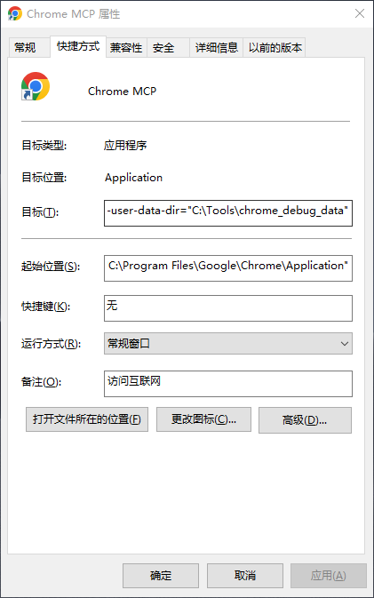
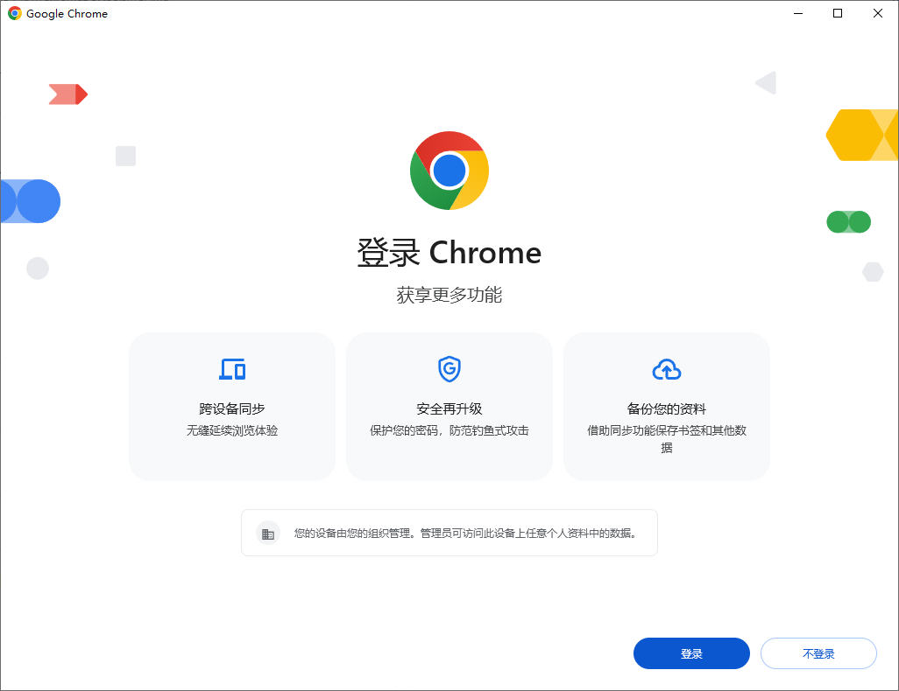
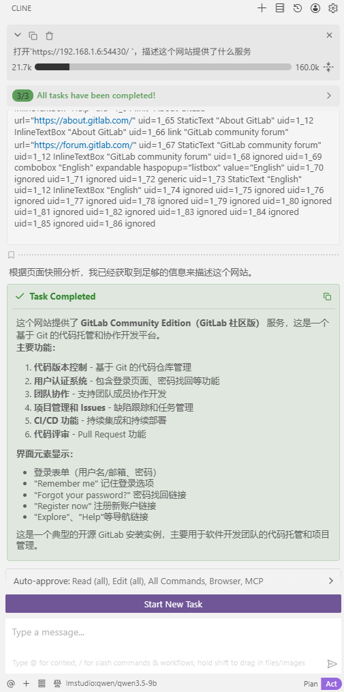

# 在 Cline 中使用 Chrome DevTools MCP

本文介绍如何在 Cline 中配置 Chrome DevTools MCP，让 AI 助手能够直接操作浏览器进行网页交互。

## 1. 安装必要软件环境

- [Chrome 浏览器](https://www.google.com.hk/chrome/dr/download/)
- [Node.js](https://nodejs.org/en/download)

## 2. 创建 Chrome 快捷方式

创建一个 Chrome 快捷方式，并修改「目标」参数：



**目标内容：**

```
"C:\Program Files\Google\Chrome\Application\chrome.exe" --remote-debugging-port=9222 --user-data-dir="C:\Tools\chrome_debug_data"
```

**参数说明：**

| 参数 | 说明 |
|------|------|
| `"C:\Program Files\Google\Chrome\Application\chrome.exe"` | Chrome 可执行文件路径 |
| `--remote-debugging-port=9222` | 将 MCP 服务开放在 9222 端口 |
| `--user-data-dir="C:\Tools\chrome_debug_data"` | 指定 Chrome 用户数据存储目录 |

首次打开此快捷方式时，会看到 Chrome 欢迎页面：



## 3. 验证 MCP 服务

在另一个浏览器中访问：

```
http://localhost:9222/json
```

若返回类似以下内容，说明 Chrome MCP 服务已成功启动：

```json
[
  {
    "description": "...",
    "devtoolsFrontendUrl": "...",
    "id": "...",
    "title": "...",
    "type": "...",
    "url": "...",
    "webSocketDebuggerUrl": "..."
  }
]
```

## 4. 配置 Cline

打开 Cline 配置文件，添加以下字段：

```json
{
  "cline.mcpServers": {
    "chrome-devtools": {
      "disabled": false,
      "timeout": 60,
      "type": "stdio",
      "command": "npx",
      "args": [
        "-y",
        "chrome-devtools-mcp@latest",
        "--browser-url=http://127.0.0.1:9222"
      ]
    }
  }
}
```

**参数说明：**

| 参数 | 说明 |
|------|------|
| `npx` | 运行 npm 包，未安装时自动下载 |
| `-y` | 自动批准安装，无需交互确认 |
| `chrome-devtools-mcp@latest` | 使用最新版本的 chrome-devtools-mcp 工具 |
| `--browser-url=http://127.0.0.1:9222` | 连接到指定的浏览器实例；若省略此参数，每次都会启动一个干净的 Chrome 浏览器 |

## 完成

配置完成后，即可让 Cline 进行网页操作。

