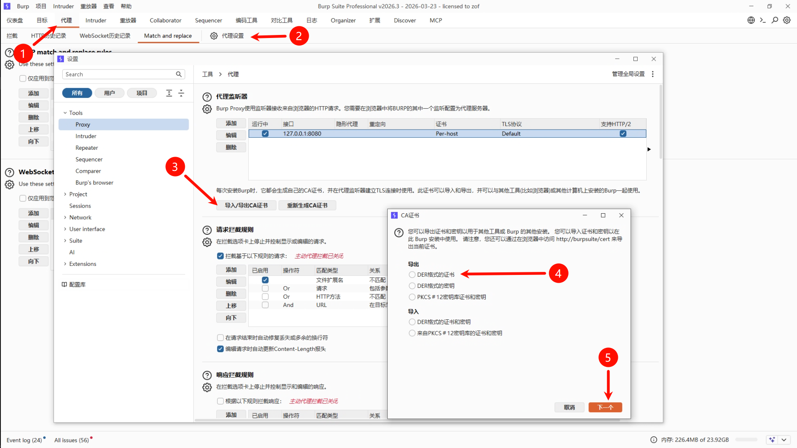
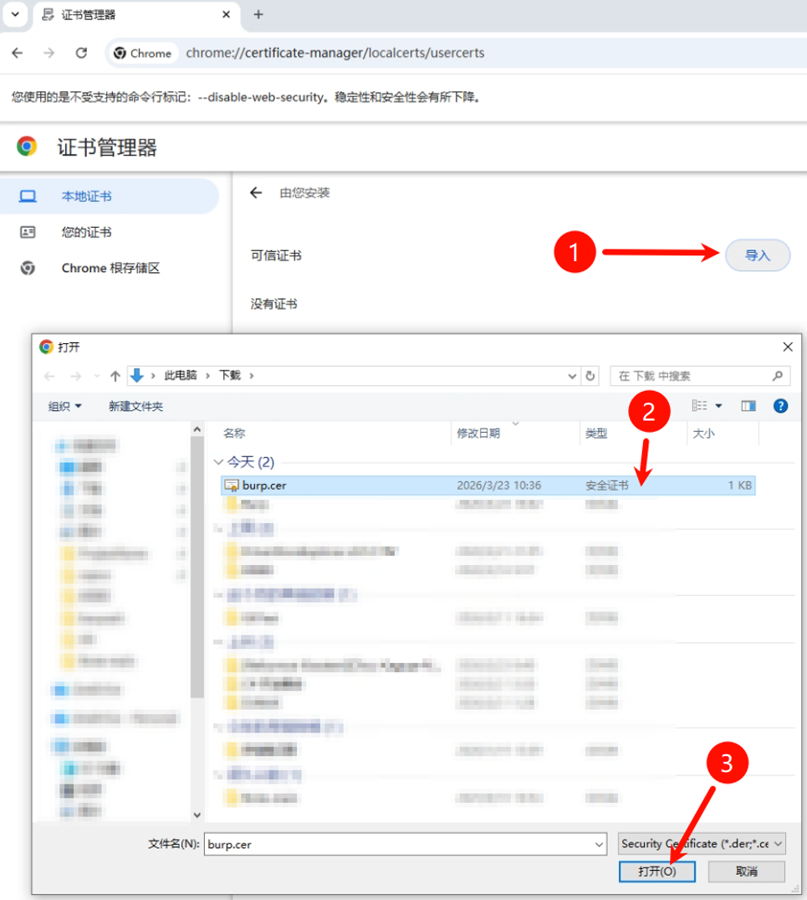
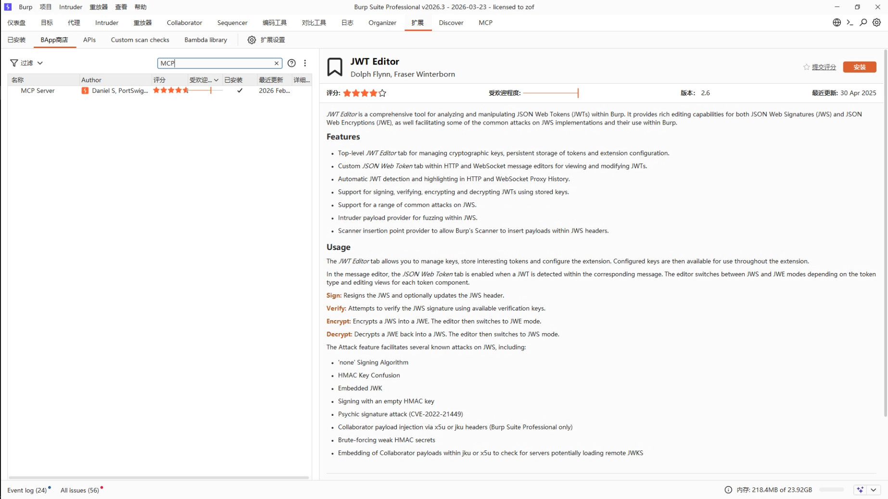
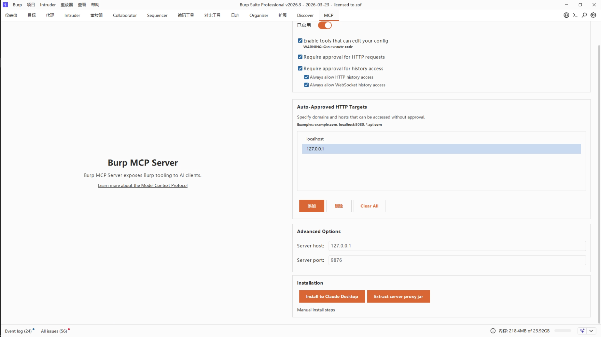

# 在Cline中配置BurpMcp并配合浏览器

本文档介绍如何在Cline中配置Burp MCP，并配合浏览器进行安全测试。

---

## 前置条件

确保已经配置了浏览器Mcp。

## 一、配置Chrome调试模式

### 1. 创建Chrome快捷方式

新建一个Chrome的快捷方式，修改目标参数：

```
"C:\Program Files\Google\Chrome\Application\chrome.exe" --remote-debugging-port=9222 --user-data-dir="C:\Tools\chrome_debug_data" --auto-open-devtools-for-tabs --proxy-server="127.0.0.1:8080"
```

### 2. 参数说明

| 参数 | 说明 |
|------|------|
| `--remote-debugging-port=9222` | Chrome允许通过本地`9222`端口进行调试 |
| `--user-data-dir="C:\Tools\chrome_debug_data"` | Chrome调试模式的数据存储目录 |
| `--proxy-server="127.0.0.1:8080"` | 设置Burp代理地址 |
| `--auto-open-devtools-for-tabs` | 打开标签页时自动打开开发者工具 |

---

## 二、设置Chrome信任Burp证书

### 1. 导出Burp证书

在Burp中操作：

**代理** → **代理设置** → **导入/导出CA证书** → **导出DER格式的证书** → 保存为 `burp.cer`



### 2. 导入证书到Chrome

1. 打开之前创建的Chrome快捷方式
2. 访问 `chrome://certificate-manager/localcerts/usercerts`
3. 点击"导入"，选择之前导出的 `burp.cer` 证书



---

## 三、安装Burp MCP Server

### 1. 安装扩展

在Burp界面中：

**扩展** → **BApp商店** → 搜索 **MCP Server** → 安装第一个结果



### 2. 配置服务地址

安装完成后，在MCP设置中可以修改IP与端口。服务默认在 `http://127.0.0.1:9876` 提供服务。



---

## 四、在Cline中配置Burp MCP

打开Cline的MCP设置，添加以下配置：

```json
{
    "mcpServers": {
        "burp": {
            "type": "sse",
            "url": "http://127.0.0.1:9876/"
        }
    }
}
```

配置完成后，Cline即可通过MCP与Burp进行交互。